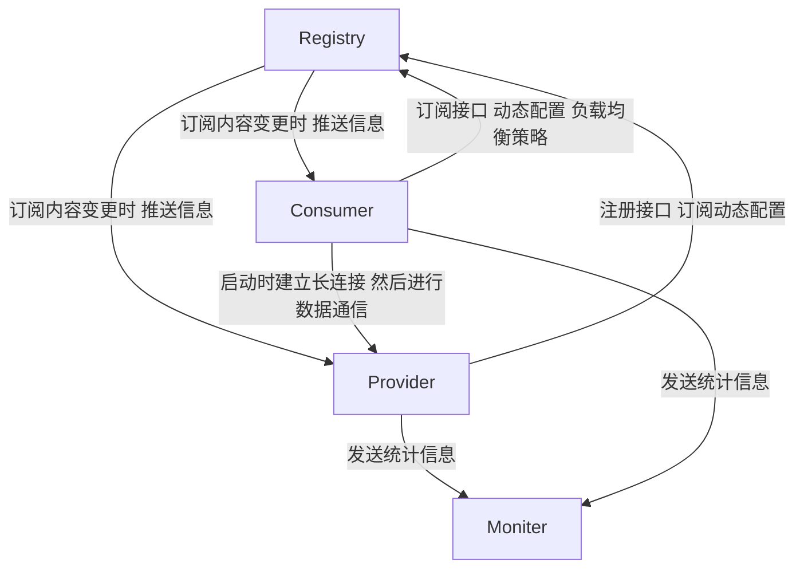

# Dubbo

[TOC]

## 面试题

https://juejin.cn/post/6844904127076499463


## 尚硅谷视频

### 基础知识


**分布式系统**：

若干独立计算机的集合，这些计算机对于用户来说**就像单个系统**


**架构发展演变**：

- 单体架构

  网站流量下 只需要一个应用 包含所有功能 

  问题：某个功能模块改了 就要重新发版 而且一个功能模块OOM了 整个服务就挂了 耦合度高 扩展度低

- 垂直应用架构

  将不同的功能模块拆成不用的应用（前后端在一起）

  可以单独扩缩容

  问题：前后端不分离 很多业务逻辑是重复的 没有充分复用

- 分布式服务架构：

  前后端分离 后端之间也会相互调用

- 流动计算架构：

  有调度中心和治理中心 管理集群


**RPC**

远端过程调用 

- 通讯：通过socket实现 
- 序列化：需要将请求与响应进行序列化和反序列化


**Dubbo**

高性能 轻量级的RPC框架 

- 面向接口的远程方法调用
- 智能容错和负载均衡
- 服务自动注册和发现


架构图：


> consumer与provider是直接建立socket通信 并不会走Registry 


### 高可用

- 部分或者全部注册中心节点或者部分服务提供者节点挂了  消费者还可以调用服务

  原因：

  - 注册中心部分挂了：集群中的角色是对等的 
  - 注册中心全部挂了：通过本地缓存通讯
  - 服务提供者部分挂了：是无状态的 不影响使用

- 负载均衡策略

  - 按权重随机
  - 轮询
  - 最少活跃：将请求更多分配到响应速度快的服务器上
  - 一致性哈希：请求参数相同 目的机器相同

- 服务降级与容错

  服务降级：对某些远程调用直接返回null 不发起远程调用 或者在调用报错时返回null值 不抛出异常 用来临时屏蔽某个非关键服务 以减少资源使用和避免影响正常逻辑

  容错：调用失败时的处理机制

  - 自动重试其他服务器 重试次数可以配置 一般用于读操作
  - 失败一次立即报错 一般用于非幂等的写操作
  - 失败了直接武略 一般用于写日志等操作
  - 失败了后台记录下来 后面定时重发 用于消息通知等操作
  - 并行调用多个服务器 只要有一个返回成功就返回 用于实时性较高的操作
  - 广播调用所有服务提供者 用于通知所有提供者更新缓存等本地资源


### Dubbo原理

RPC原理：


RPC调用流程（同步调用）2-6就是RPC框架需要做的事情

1. 服务调用方通过本地调用方式调用服务
2. client stub接收到调用后负责将方法 参数组成可以进行网络传输的消息体 然后找到服务地址 将消息发送到服务端
3. server stub解码消息并根据解码后的结果调用本地的服务
4. 本地服务执行并将结果返回给server stub
5. server stub将返回结果打包并将消息发送至消费方
6. client stub接收到消息并解码
7. 服务消费方得到调用结果


Netty原理：


会有一个Thread专门监听连接事件 其他的一个线程组监听读写事件


Dubbo原理：


- config 配置层：对外配置接口，以 ServiceConfig, ReferenceConfig 为中心，可以直接初始化配置类，也可以通过 spring 解析配置生成配置类

- proxy 服务代理层：服务接口透明代理，生成服务的客户端 Stub 和服务器端 Skeleton, 以 ServiceProxy 为中心，扩展接口为 ProxyFactory

- registry 注册中心层：封装服务地址的注册与发现，以服务 URL 为中心，扩展接口为 RegistryFactory, Registry, RegistryService

- cluster 路由层：封装多个提供者的路由及负载均衡，并桥接注册中心，以 Invoker 为中心，扩展接口为 Cluster, Directory, Router, LoadBalance

- monitor 监控层：RPC 调用次数和调用时间监控，以 Statistics 为中心，扩展接口为 MonitorFactory, Monitor, MonitorService

- protocol 远程调用层：封装 RPC 调用，以 Invocation, Result 为中心，扩展接口为 Protocol, Invoker, Exporter

- exchange 信息交换层：封装请求响应模式，同步转异步，以 Request, Response 为中心，扩展接口为 Exchanger, ExchangeChannel, ExchangeClient, ExchangeServer

- transport 网络传输层：抽象 mina 和 netty 为统一接口，以 Message 为中心，扩展接口为 Channel, Transporter, Client, Server, Codec

- serialize 数据序列化层：可复用的一些工具，扩展接口为 Serialization, ObjectInput, ObjectOutput, ThreadPool


## Dubbo源码分析

### Dubbo架构



### Dubbo SPI

>  SPI目的：通过读取配置文件 来获取一个接口的实现类
>
>  为什么需要设计自己的一套SPI：
>
>  ```java
>  // jdk原版：会一次加载所有实现子类 
>  ServiceLoader<Command> serviceLoader=ServiceLoader.load(Command.class); 
>    for(Command command:serviceLoader){  
>        command.execute();  
>    }  
>  ```
>
>  Dubbo SPI特有功能：
>
>  - 缓存： SPI的缓存 ExtensionLoader里面cachedInstances key(SPI配置文件里面的) ->
>
>  - 默认值：指定默认实现类
>
>    ```java
>    // 定义
>    @SPI("dubbo")
>    public interface Protocol
>    // 取出
>    ExtensionLoader.getExtensionLoader(Protocol.class).getDefaultExtension()  
>    ```
>
>  - 可以通过key指定要实现的spi对象
>
>    ```java
>    /META-INF/dubbo/internal
>    dubbo=org.apache.dubbo.rpc.protocol.dubbo.DubboProtocol
>    ExtensionLoader.getExtensionLoader(Protocol.class).getExtension("dubbo")  
>    ```
>
>  - 增加了IOC功能：通过构造函数注入
>
>    ```java
>    wrapperClass.getConstructor(type).newInstance(instance)
>    ```
>
>  - 增加了AOP功能：
>
>    在原始spi类，包装了XxxxFilterWrapper XxxxListenerWrapper

实现：

```java
// 途径
ExtensionLoader.getExtension(String name)
  
// 先为其他的类初始化一个ExtensionFactory的ExtensionLoader
// 之后其他类的实现子类的对象创建都通过这个ExtensionLoader里面的getAdaptiveExtension()中获得的objectFactory创建(也就是为dubbo的IOC提供所有对象)
```

 核心类：`ExtensionLoader`

核心注解：

`@Adaptive` 可以加在类上 也可以加在方法上 加在类上是静态代理 加在方法上是动态代理


API调用:

```java
xxInterace impl = ExtensionLoader.getExtensionLoader(xxInterface.class).getExtension("xxKey")
```


- `ExtensionLoader.getExtensionLoader(type.class)`

  该type接口需要有`@SPI`注解

  ```java
  public static <T> ExtensionLoader<T> getExtensionLoader(Class<T> type) {
    			// 先从map中取 取不到就创建 关键在构造函数
          ExtensionLoader<T> loader = (ExtensionLoader<T>) EXTENSION_LOADERS.get(type);
          if (loader == null) {
              EXTENSION_LOADERS.putIfAbsent(type, new ExtensionLoader<T>(type));
              loader = (ExtensionLoader<T>) EXTENSION_LOADERS.get(type);
          }
          return loader;
      }
  
  private ExtensionLoader(Class<?> type) {
    			// 每个ExtensionLoader对应一个接口
          this.type = type;
    			// objectFactory 为dubbo IOC提供所有对象
    			// 会先去初始化ExtensionFactory的ExtensionLoader
    			// 然后将所有的其他的接口的objectFactory赋值为ExtensionFactory的子类
          // AdaptiveExtensionFactory[SpiExtensionFactory,SpringExtensionFactory]
    			objectFactory =
                  (type == ExtensionFactory.class ? null : ExtensionLoader.getExtensionLoader(ExtensionFactory.class).getAdaptiveExtension());
      }
  ```

- `getAdaptiveExtension()` ：语义：获取代理子类

  - `createAdaptiveExtension()`

  - `getAdaptiveExtensionClass()` 获取Class对象

    这里有两个分支

    - 如果该接口有子类的上有注解`@Adaptive` 如`AdaptiveExtensionFactory`

      则会去根据/META-INF/dubbo/internal的路径下 找出全类名 加载出该类

    - 如果没有则该接口的某个方法上需要有`@Adaptive`注解 会调用Javasisit的类库来编译拼接出的代理的该接口的类

  - `injectExtension(T instance)` IOC（对象实例的生成权交给IOC容器） 依赖注入

    将对象中所有含有setter方法的属性 都通过adaptiveExtensionFactory.getExtension(Class<T> type, String name) 获取 并注入到对象中

- `getExtension(key)`

  - `getExtensionClasses()` 这里找出了key对应的实现类 同时也将具有装饰功能的类放到了`cachedWrapperClasses` 里面

  - `injectExtension(instance)` IOC  IOC容器有两个 一个是SPI 一个是Spring SPI找不到才会去Spring中找

  - AOP实现：

    ```java
    // wrapperClass 都是对该接口具有装饰功能的类 一层层装饰
    // 不断套功能 形成AOP的效果
    for (Class<?> wrapperClass : wrapperClassesList) {
            instance = injectExtension((T) wrapperClass.getConstructor(type).newInstance(instance));
                        }
    ```

    

  


### 服务发布

spring容器初始化 调用`refresh`方法 调用完后发布事件（观察者模式）

Dubbo的`DubboBootstrapApplicationListener`监听该事件 触发`dubboBootstrap.start()`

`exportServices()`：将所有的Dubbo Service Bean都发布出去

`exportService(serviceConfig)` 发布单个服务（Bean 一个Dubbo Service对应一个ServiceConfig）

`doExportUrlsFor1Protocol(protocolConfig, registryURLs, protocolConfigNum)`：将某个服务发布到某个协议上（可以发到多个协议 默认为dubbo）

`exportLocal(url)` 暴露服务给本地JVM调用

```java
// 暴露服务给远程dubbo调用
// 为当前服务的实现类ref 建立代理类invoker 
Invoker<?> invoker = PROXY_FACTORY.getInvoker(ref, (Class) interfaceClass,
                                registryURL.addParameterAndEncoded(EXPORT_KEY, url.toFullString()));

// 这里分两步走 调用的是动态生成的代理类Protocol$Adaptive的export方法 javassit库生成
// 因为invoker的url前缀为registry 所以会先调用到RegistryProtocol 的export
Exporter<?> exporter = PROTOCOL.export(wrapperInvoker);

// 1.RegistryProtocol的export里面先调用DubboProtocol的export方法 开启netty端口
// 将key: 接口名:端口号 -> exporter（里面封装了invoker(里面封装了接口的具体实现类的引用)） 放到一个map里面 供以后取出来调用
exporterMap.addExportMap(key, exporter);

// Exchanger层
server = Exchangers.bind(url, requestHandler)

// Transporter层
// 默认使用netty4 启动netty server
new NettyServer(url, handler)
  
// 2.再调用RegistryProtocol export方法中的  
//  2.1 Registry registry = getRegistry(originInvoker) 连接到注册中心
//  2.2 registry.register(registeredProviderUrl) 发布暴露的服务的消息到注册中心
//  2.3 registry.subscribe(overrideSubscribeUrl, overrideSubscribeListener); 订阅注册中心的消息  
```


```java
package org.apache.dubbo.rpc;

import java.util.List;
import org.apache.dubbo.common.URL;
import org.apache.dubbo.common.extension.ExtensionLoader;

public class Protocol$Adaptive implements Protocol {
    public void destroy() {
        throw new UnsupportedOperationException("The method public abstract void org.apache.dubbo.rpc.Protocol.destroy() of interface org.apache.dubbo.rpc.Protocol is not adaptive method!");
    }

    public int getDefaultPort() {
        throw new UnsupportedOperationException("The method public abstract int org.apache.dubbo.rpc.Protocol.getDefaultPort() of interface org.apache.dubbo.rpc.Protocol is not adaptive method!");
    }

  // 这里其实就是根据Invoker里面的url前缀选择不同的protocol实现
    public Exporter export(Invoker var1) throws RpcException {
        if (var1 == null) {
            throw new IllegalArgumentException("org.apache.dubbo.rpc.Invoker argument == null");
        } else if (var1.getUrl() == null) {
            throw new IllegalArgumentException("org.apache.dubbo.rpc.Invoker argument getUrl() == null");
        } else {
            URL var2 = var1.getUrl();
            String var3 = var2.getProtocol() == null ? "dubbo" : var2.getProtocol();
            if (var3 == null) {
                throw new IllegalStateException("Failed to get extension (org.apache.dubbo.rpc.Protocol) name from url (" + var2.toString() + ") use keys([protocol])");
            } else {
                Protocol var4 = (Protocol)ExtensionLoader.getExtensionLoader(Protocol.class).getExtension(var3);
                return var4.export(var1);
            }
        }
    }

    public List getServers() {
        throw new UnsupportedOperationException("The method public default java.util.List org.apache.dubbo.rpc.Protocol.getServers() of interface org.apache.dubbo.rpc.Protocol is not adaptive method!");
    }

    public Invoker refer(Class var1, URL var2) throws RpcException {
        if (var2 == null) {
            throw new IllegalArgumentException("url == null");
        } else {
            String var4 = var2.getProtocol() == null ? "dubbo" : var2.getProtocol();
            if (var4 == null) {
                throw new IllegalStateException("Failed to get extension (org.apache.dubbo.rpc.Protocol) name from url (" + var2.toString() + ") use keys([protocol])");
            } else {
                Protocol var5 = (Protocol)ExtensionLoader.getExtensionLoader(Protocol.class).getExtension(var4);
                return var5.refer(var1, var2);
            }
        }
    }

    public Protocol$Adaptive() {
    }
}

```


### 服务引用

> 即代理对象的获取过程


`DemoService demoService = (DemoService)context.getBean("demoService");`

`referenceBean.getObject()`

`referenceConfig.get()`

`init()`

`ref = createProxy(map);`创建该接口的代理对象

- `invoker = REF_PROTOCOL.refer(interfaceClass, urls.get(0));` 获取invoker

  - registryProtocol.refer 

    `Registry registry = getRegistry(url);` 连接到注册中心

    doRefer

    `interceptInvoker`

    `listener.onRefer(this, invoker, consumerUrl)`

    `migrationInvoker.fallbackToInterfaceInvoker()`

    `refreshInterfaceInvoker()`

    `invoker = registryProtocol.getInvoker(cluster, registry, type, url)`

    `doCreateInvoker(directory, cluster, registry, type)`

    - `registry.register(directory.getRegisteredConsumerUrl())`注册消费者
    - `directory.subscribe(toSubscribeUrl(urlToRegistry))` 订阅该接口下的configurators, providers, routers
    - `cluster.join(directory)` 集群路由

- `PROXY_FACTORY.getProxy(invoker, ProtocolUtils.isGeneric(generic))` 通过动态代理创建该接口的代理对象


### 服务请求

> 通过netty发送网络请求
>
> 异步转同步等待请求结果返回


`String hello = demoService.sayHello("world");`

- **Consumer发送**

实际上调用的是上面动态代理生成的对象 

所以会进入`InvokerInvocationHandler.invoke`

`AbstractClusterInvoker.invoke`

```java
// 到directory中 根据指定的router过滤规则过滤后 找出所有可选的invoker
// 一个directory对应一个注册中心 里面含有多个invoker（代表服务提供者）
List<Invoker<T>> invokers = list(invocation);
// SPI拿到loadbalance的一个实现子类
        LoadBalance loadbalance = initLoadBalance(invokers, invocation);
```

`FailoverClusterInvoker.doInvoke` 默认的策略：失败重试 

```java
// 根据负载均衡策略(默认为随机) 从可选的invoker中 选出一个 
Invoker<T> invoker = select(loadbalance, invocation, copyInvokers, invoked);
Result result = invoker.invoke(invocation);
AbstractInvoker.invoke
asyncResult = (AsyncRpcResult) doInvoke(invocation);
```

`AsyncToSyncInvoker.invoke`

```java
Result asyncResult = invoker.invoke(invocation);
// 异步转同步的地方 等待直到completableFuture里面的result不为null 或者超时
asyncResult.get(Integer.MAX_VALUE, TimeUnit.MILLISECONDS);
```

`DubboInvoker.doInvoke`

```java
CompletableFuture<AppResponse> appResponseFuture =
        currentClient.request(inv, timeout, executor).thenApply(obj -> (AppResponse) obj);
```

`NettyChannel.send`

```java
// 通过netty的channel发送网络数据 RpcInvocation
channel.writeAndFlush(message)
```


- **Consumer接收**

`NettyClientHandler.channelRead`

`AllChannelHandler.received`

```java
ExecutorService executor = getPreferredExecutorService(message);
// 放到线程池
executor.execute(new ChannelEventRunnable(channel, handler, ChannelState.RECEIVED, message));
```

`DecodeHandler.received`

`HeaderExchangeHandler.received`

```java
handleResponse(channel, (Response) message);
```

`DefaultFuture.received`

```java
// 保护性暂停：通过id从map中取出对象
DefaultFuture future = FUTURES.remove(response.getId());
// 这里面会将响应结果对象 CAS替换到DefaultFuture 也就是CompletableFuture的result里面 使得AsyncToSyncInvoker那里返回
future.doReceived(response);
```


### 服务响应

`NettyServerHandler.channelRead`

跟consumer client端一样的流程 最终到`HeaderExchangeHandler.handleRequest(exchangeChannel, request)`

```java
// 进入dubboProtocol
CompletionStage<Object> future = handler.reply(channel, msg);
future.whenComplete((appResult, t) -> {
    try {
        if (t == null) {
            res.setStatus(Response.OK);
            res.setResult(appResult);
        } else {
            res.setStatus(Response.SERVICE_ERROR);
            res.setErrorMessage(StringUtils.toString(t));
        }
      	// 将处理的结果发送回去
        channel.send(res);
    } catch (RemotingException e) {
        logger.warn("Send result to consumer failed, channel is " + channel + ", msg is " + e);
    }
});
```

`DubboProtocol.requestHandler.reply`

```java
Invocation inv = (Invocation) message;
// 从服务暴露的map中拿出具体的暴露的服务的实现子类的引用
Invoker<?> invoker = getInvoker(channel, inv);
	DubboExporter<?> exporter = (DubboExporter<?>) exporterMap.getExport(serviceKey);
	exporter.getInvoker();
// 反射调用 入参：T proxy, String methodName, Class<?>[] parameterTypes, Object[] arguments
Result result = invoker.invoke(inv);
```


### 编解码

编码目的：解决TCP粘包 拆包问题

粘包：

- 定义：一个数据包里面包含了两个数据包的内容

- 出现原因：socket的一次报文发送中会包含应用程序的多次写入
  - 应用程序写入socket的数据小于socket缓冲区 网卡会将应用多次写入的数据发送到网络上（合为一个TCP报文）
  - 接收方法不及时读取socket缓冲区数据

拆包：

- 定义：一个包的内容被分到了多个包里面
- 出现原因：无法一次将应用程序一次写入的数据发完
  - 应用程序写入数据大于socket缓冲区
  - TCP报文 > MSS时（实际是MTU控制） 

解决方法：应用程序规定好一个数据单位的数据格式 使得接收方能明确分辨出一个数据单位

- 固定长度 不够的补充0
- 在发送数据之间加上特殊符号表示边界（FTP）
- 消息 = 消息头 + 消息体 其中消息头中含有整个数据包的长度(Dubbo采用)


**请求消息的编码格式**

`ExchangeCodec.encodeRequest`

```java
// 消息头(16B) + 消息体
// 消息头：
// 2B magic number
Bytes.short2bytes(MAGIC, header);
// 1B 消息体的序列化方式（低5bit）默认为hessian2 + 消息标志：是否为双向消息 是否为事件消息（dubbo自身事件 如心跳）
header[2] = (byte) (FLAG_REQUEST | serialization.getContentTypeId());
if (req.isTwoWay()) {
  header[2] |= FLAG_TWOWAY;
}
if (req.isEvent()) {
  header[2] |= FLAG_EVENT;
}
// 1B 没有用上
// 8B request id long类型 用于作异步转同步用的全局唯一ID AtomicLong(0).getAndIncrement()
Bytes.long2bytes(req.getId(), header, 4);
// 4B 消息头 + 消息体的长度
int len = bos.writtenBytes();
Bytes.int2bytes(len, header, 12);

// 消息体 实际上就是一个RpcInvocation对象
// DubboCodec.encodeRequestData
// 依次写入 版本 服务名 服务版本 方法名 方法参数 入参 附带的attachments map 
// ObjectOutput out = serialization.serialize(channel.getUrl(), bos); 
// 序列化会决定每个被写入的对象的字节表示
RpcInvocation inv = (RpcInvocation) data;
out.writeUTF(version);
String serviceName = inv.getAttachment(INTERFACE_KEY);
if (serviceName == null) {
  serviceName = inv.getAttachment(PATH_KEY);
}
out.writeUTF(serviceName);
out.writeUTF(inv.getAttachment(VERSION_KEY));
out.writeUTF(inv.getMethodName());
out.writeUTF(inv.getParameterTypesDesc());
Object[] args = inv.getArguments();
if (args != null) {
  for (int i = 0; i < args.length; i++) {
    out.writeObject(encodeInvocationArgument(channel, inv, i));
  }
}
out.writeAttachments(inv.getObjectAttachments());
```


**响应消息的编码格式**

```java
// 消息头(16B) + 消息体
// 2B magic number
Bytes.short2bytes(MAGIC, header);
// 1B 标记序列化协议 + 是否为心跳的标识
header[2] = serialization.getContentTypeId();
if (res.isHeartbeat()) {
  header[2] |= FLAG_EVENT;
}
// 1B 结果响应码
header[3] = status;
// 8B request ID
Bytes.long2bytes(res.getId(), header, 4);
// 4B 消息头 + 消息体的长度
int len = bos.writtenBytes();
Bytes.int2bytes(len, header, 12);

// 消息体 实际上是一个Result对象
// DubboCodec.encodeResponseData
// 会在第一个字节中标明result的类型：是否为异常 是否有附带的map
// 没有异常 且有返回值的情况
out.writeByte(attach ? RESPONSE_VALUE_WITH_ATTACHMENTS : RESPONSE_VALUE);
out.writeObject(ret);
```

