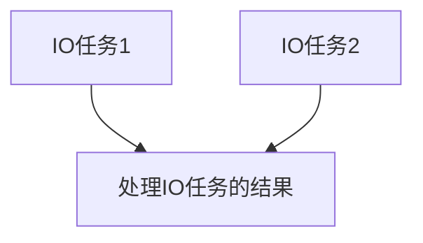

#  Java并发编程

[TOC]

**学习并发编程方法**：

- 先建立一个张全景图

  并发编程要处理的三个问题：

  - 分工：分配任务给线程 

    分工方法：

    - Executor
    - Fork/Join
    - Future

    设计模式：

    - 生产者 - 消费者
    - Thread-Per-Message
    - Worker Thread

  - 协作：线程之间的协作 CountDownLatch

    一个线程执行完之后 如何通知后序的线程执行任务

    线程协作问题：

    - 当某个条件不满足时 线程需要等待

    - 当某个条件满足时 线程需要被唤醒执行

    管程：线程协作技术的底层

  - 互斥：解决线程安全的核心方案

    某一个时刻 只允许一个线程访问共享变量

  

  

- 在某个问题上钻进去，深入理解，找到本质

  从 JDK到操作系统 到操作系统概念提出解决的问题


## 并发理论基础


### **可见性 原子性 有序性**

> 都是并发编程所需要解决的问题


高级语言外其他部分进行的优化

- 计算机组成：CPU缓存
- 操作系统：多线程 CPU时间片分配 
- 编译原理：编译程序优化指令执行的次序


**CPU缓存导致的可见性问题**

每个cpu都有自己私有的缓存，数据写入时先写到缓存中（然后再某个时间内再刷新到内存中 时间不定）


**cpu时间片的任务切换带来的原子性问题**

> 原子性：一个或多个操作在CPU执行的过程中不被中断的特性

高级语言中的`count++` 在cpu指令层面至少需要3条语句：

- 将count值加载到寄存器
- +1操作
- 结果写回内存（缓存机制导致先写回cpu缓存）

操作系统的任务切换会发生在任何一条指令执行后


**编译优化带来的有序性问题**

编译器调整了语句的执行顺序，但是保证不影响执行结果

```java
private static class Singleton {

        static Singleton singleton;
        
        static Singleton getInstance() {
            if (singleton == null) {
                synchronized (Singleton.class) {
                    if (singleton == null) {
                      // 关键地方在于 new Singleton()的执行顺序
                        singleton = new Singleton();
                    }
                }
            }
            return singleton;
        }
    }
```

`new Singleton()`优化后的执行指令

- 在堆上分配一个块内存M
- 将M的地址分配给singleton
- 在内存M上初始化对象

先分配地址，再进行初始化，就使得未初始化完成的实例被暴露出去，访问其成员变量时就有可能报空指针异常


### Java内存模型：解决可见性和有序性问题

可见性问题由于CPU缓存导致，有序性由于编译优化乱序导致，所以**按需**禁用缓存和编译优化就能解决问题

Java内存模型规范了JVM提供解决可见性和有序性问题的方法

- `volatile`

  语义：禁用CPU缓存

- `sychronize`

  因为解锁先于加锁 所以解锁前所有的操作对加锁的线程都是可见的

- `final`

  对象初始化后不会改变 提示编译器随便优化

- `Happens-Before`

  > 前面一个操作的结果 对后面一个操作是可见的

  - 单线程中控制流前面的操作先于后面的操作

  - 对`volatile`变量的写操作先于对其的读操作
  - 对同一个锁的解锁操作先于对一个锁的加锁操作
  - happens-before具有传递性
  - 一个线程的`thread.start()`方法先于该线程的执行
  - 线程的执行先于`thread.join()`

```java
/**
 * @ description:
 * @ author: daxiao
 * @ date: 2021/9/20
 * 1 单线程中控制流前面的操作先于后面的操作
 * 2 对`volatile`变量的写操作先于对其的读操作
 * 3 对同一个锁的解锁操作先于对一个锁的加锁操作
 * 4 happens-before具有传递性
 * 5 一个线程的`thread.start()`方法先于该线程的执行
 * 6 线程的执行先于`thread.join()`
 */
public class HappensBeforeDemo {

    private static int globalVar;

    private static volatile boolean flag;

    /**
     * 写线程中执行
     */
    public static void write() {
        // 1.单线程中 对globalVar的赋值的结果 对 flag=true这里可见
        globalVar = 1;
        flag = true;
    }

    /**
     * 读线程中执行
     */
    public static void read() {
        // 2. flag的写 对flag的读可见
        System.out.println("flag:" + flag);
        // 3. 传递性：globalVar = 1; 先于 flag = true 先于 System.out.println("flag:" + flag);
        // 所以这里能看到globalVar写的结果
        System.out.println("var:" + globalVar);
    }

    private synchronized static void syncAdd() {
        // 对global变量的写 先于解锁 且解锁时会强制刷新数据到缓存
        globalVar += 10;
    }

    public static void main(String[] args) throws InterruptedException {
//        test123();
//        test5();
//        test5();
//        test6();
    }

    private static void test6() throws InterruptedException {
        Thread thread = new Thread(HappensBeforeDemo::write);
        thread.start();
        thread.join();
        read();
    }

    private static void test4() throws InterruptedException {
        new Thread(HappensBeforeDemo::syncAdd).start();
        Thread.sleep(100);
        System.out.println("var:" + globalVar);
    }

    private static void test5() {
        // 测试 5
        globalVar = 100;
        new Thread(HappensBeforeDemo::read).start();
    }

    private static void test123() throws InterruptedException {
        // 测试 1 2
        new Thread(HappensBeforeDemo::write).start();
        Thread.sleep(1000);
        new Thread(HappensBeforeDemo::read).start();
    }
}
```


### 锁

互斥：同一个时刻只有一个线程执行对共享变量的修改

解决原子性问题本质：保证中间状态对外不可见


锁模型

- 对什么加锁
- 保护的是什么资源
- 受保护的资源与锁之间的关系应该是N : 1的关系


```java
public class SafeAdder {
    
    private long count;

    /**
     * get加锁是为可见性
     */
    public synchronized long get() {
        return count;
    }

    /**
     * synchronize保证了原子性和可见性(happens-before原则推导出)
     */
    public synchronized void add(long amount) {
        count += amount;
    }
}
```


当需要保护多个资源时，分析资源之间的关系，如果资源间没有关联关系，则各自用各自的锁（细粒度锁，减少互斥，提供并行度）


**死锁**

死锁出现的必要条件：

- 互斥：共享资源某一时刻只能由一个线程占有
- 占有并等待：线程t1已占有某资源，在申请新资源时不释放已有资源
- 不可抢占：其他线程不能抢占t1的资源
- 循环等待：t1等待t2占有的资源，t2等待t1占有的资源

死锁避免：破坏死锁出现的必要条件

- 互斥：无法破坏，用锁的目的就是为了互斥

- 占有并等待：一次性获取所有需要的资源，就不存在等待

  ```java
  public class AccountAllocator {
  
      /**
       * 已经被分配的对象（锁）
       */
      private Set<Account> allocatedAccount = new HashSet<>();
      
      public synchronized boolean apply(Account from, Account to) {
          if (allocatedAccount.contains(from) || allocatedAccount.contains(to)) {
              return false;
          }
          allocatedAccount.add(from);
          allocatedAccount.add(to);
          return true;
      }
      
      public synchronized void free(Account from, Account to) {
          allocatedAccount.remove(from);
          allocatedAccount.remove(to);
      }
  }
  
      public void transfer(Account target, long amount) {
          while (!accountAllocator.apply(this, target)) {
              // 循环直到获取两个对象的锁
          }
          try {
              synchronized (this) {
                  synchronized (target) {
                      balance -= amount;
                      target.balance += amount;
                  }
              }
          } finally {
              accountAllocator.free(this, target);
          }
      }
  ```

  

- 不可抢占：当线程获取不了新的资源的时候，就释放已经占有的资源 `synchronize`关键字无法做到，因为线程已经阻塞了，干不了什么活了

- 循环等待：给资源编号，只能按某一个方向（如：从小到大）申请资源

  ```java
         public void transfer(Account target, long amount) {
          Account firstLock = target;
          Account secondLock = this;
          if (id < target.id) {
              firstLock = this;
              secondLock = target;
          }
          synchronized (firstLock) {
              synchronized (secondLock) {
                  balance -= amount;
                  target.balance += amount;
              }
          }
  ```

  


```json
接口鉴权API
uri: "/kuanGuang/token" 
method: GET
请求参数json：
{
  "username": "SecAdmin",
  "password": "密码的base64编码"
}

返回:
{
  "code": 0
  "data": {
  	"token": "token的值" // 在之后的请求头中添加X-Auth-Token 值为该值
  	"expire_time": 1632382555104 // token到期时间的时间戳 
	}
}
```


**通知-等待机制**

1. 首先线程获取到互斥锁后，发现要求的条件不满足时，释放互斥锁，进行等待

2. 当线程要求的条件满足时，通知等待的线程，重新获取互斥锁


```java
public class AccountAllocator {

    /**
     * 已经被分配的对象（锁）
     */
    private Set<Account> allocatedAccount = new HashSet<>();

    public synchronized boolean apply(Account from, Account to) {
        while (allocatedAccount.contains(from) || allocatedAccount.contains(to)) {
            try {
                // 获取锁之后 如果条件不满足 释放锁 进行等待(进入该互斥锁的等待队列)
                wait();
            } catch (InterruptedException e) {
                e.printStackTrace();
            }
        }
        allocatedAccount.add(from);
        allocatedAccount.add(to);
        return true;
    }

    public synchronized void free(Account from, Account to) {
        allocatedAccount.remove(from);
        allocatedAccount.remove(to);
        // 通知等待队列中的线程 条件曾经在某个时间点上满足过
      	// 尽量使用notifyAll()  
        notifyAll();
    }
}
```


### 安全性 活跃性以及性能问题

> 并发编程中需要注意的问题


**安全性问题**

线程安全的本质是正确性，就是程序执行的结果是我们所期望的


对于存在共享数据且数据会被修改的地方，就有可能会出现线程安全问题


两个问题：都可以通过锁的解决

- 数据竞争(Data Race)：多个线程访问同一个数据，且至少会有一个线程写数据，没有加防护措施，就会导致并发bug

- 竞态条件(Race Condition)：程序执行的结果依赖于线程执行的顺序


**活跃性问题**

- 死锁

- 活锁：没有发生阻塞，但仍然会有执行不下去的情况

  比如说两个人进出门，互相让，最后都无法动

  可以等待一个随机的时间

- 饥饿：线程一直获取不到所需的资源

  可以公平地分配资源 FIFO


**性能问题**

锁的过度使用会导致串行化的范围变大

- 使用无锁的方案

  copy-on-write

  TLS

  CAS

- 使用细粒度的锁


### 管程

> 管理共享变量以及对共享变量的操作过程 让他们支持并发


并发编程需要解决两大核心问题：

- 互斥：同一时刻只允许一个线程访问共享资源
- 同步：线程间的通信和协作


MESA模型：

`synchronized`关键字简化了MESA模型，只有一个条件变量


```java
public class BlockingQueue<T> {

    private Queue<T> queue;

    private Lock lock = new ReentrantLock();

    private int capacity;

    /**
     * 条件为队列不空 条件变量
     */
    private Condition notEmpty = lock.newCondition();

    /**
     * 条件为队列不满 条件变量
     */
    private Condition notFull = lock.newCondition();


    public BlockingQueue(int capacity) {
        queue = new ArrayDeque<>(capacity);
        this.capacity = capacity;
    }

    public T take() {
        lock.lock();
        T ret = null;
        try {
             while (queue.size() == 0) {
               	// 等待队列不空 也是会释放锁
               	// 被唤醒后 从条件变量的等待队列中进入到入口的等待队列 重新获取锁
                 notEmpty.await();
             }
             ret = queue.poll();
          		// 通知队列不满
             notFull.signal();
        } catch (InterruptedException e) {
            e.printStackTrace();
        } finally {
            lock.unlock();
        }
        return ret;
    }

    public void add(T t) {
        lock.lock();
        try {
            while (queue.size() == capacity) {
              	// 等待队列不满
                notFull.await();
            }
            queue.add(t);
          	// 通知队列不空
            notEmpty.signal();
        } catch (InterruptedException e) {
            e.printStackTrace();
        } finally {
            lock.unlock();
        }
    }
    
}
```


可以使用`notify()/signal()`的场景：

- 等待的线程的拥有同样的等待条件
- 所有线程被唤醒后执行同样的动作
- 只需要唤醒一个线程


### Java线程


**Java线程的生命周期**

> 与操作系统中的线程一一对应


通用的线程生命周期


1. 初始：只是在编程语言方面创建，操作系统层面没有创建线程，所以自然不允许分配CPU
2. 可运行：操作系统线程已被创建 所以可以分配CPU
3. 运行：获取到了CPU时间片
4. 休眠：等待IO或者条件变量，释放CPU使用权
5. 终止：执行完或者异常


Java线程的生命周期


状态转化：

- `RUNNABLE -> BLOCKED`：`synchronized`隐式锁

- `RUNNABLE -> WAITING`: 

  - `synchronized`后面 `wait()`
  - `thread.join()`
  - `LockSupport.park()`

- `RUNNABLE -> TIMED_WAITING` 加了超时参数

  - `Thread.sleep(ms)`
  - `Object.wait(ms)`
  - `thread.join(ms)`
  - `LockSupport.parkNanos()`
  - `LockSupport.parkUntil()`

- `NEW -> RUNNABLE` : `thread.start()`

- `RUNNABLE -> TERMINATED`: run方法执行完

- `WAITING/TIMED_WAITING -> RUNNABLE`

  其他线程调用`thread.interupt()` 主动打断该线程的等待


**线程数量的设置**

> 为了将硬件的性能发挥到极致

- CPU密集型：CPU核数 + 1
- IO密集型：核数 * （1 + IO耗时/CPU计算耗时）


**线程封闭**

方法调用栈的数据 都是线程私有的 所以不存在线程安全问题


**用面向对象的思想来写并发程序**

- 封装共享变量
- 识别共享变量间的约束关系：注意竞态条件
- 制定并发访问策略
  - 避免共享
  - 不变模式
  - 管程以及其他同步工具


## 并发工具

### Lock Condition

> 并发包中的管程

并发两大核心问题:

- 互斥：`Lock`
- 同步：`Condition`


JDK中的锁的优点：

- 能够破坏不可抢占条件：在获取锁后 相关条件不满足时 释放锁

  - 支持响应中断
  - 可设置超时
  - 可非阻塞获取锁

  ```java
  // 支持中断的API
  void lockInterruptibly() throws InterruptedException;
  // 支持超时的API
  boolean tryLock(long time, TimeUnit unit) throws InterruptedException;
  // 支持非阻塞获取锁的API
  boolean tryLock();
  ```

- 支持多个条件变量


`ReentrantLock`可见性的保证

利用的对`volatile`变量的写操作先于对其的读操作（结果可见）

```java
class X {
  private final Lock rtl =
  new ReentrantLock();
  int value;
  public void addOne() {
    // 获取锁
    rtl.lock();  
    try {
      value+=1;
    } finally {
      // 保证锁能释放
      rtl.unlock();
    }
  }
}
```

1. `unlock()` 中有对`volatile`变量的一次读写
2. `lock()` 中有对`volatile`变量的一次读写
3. 所以unlock -> lock
4. 又因为单线程中 value += 1 -> unlock （顺序性规则）
5. 所以 由传递性可知 value += 1 -> unlock -> lock 
6. 加锁中的操作对之后加锁的线程可见 


用`condition` 条件变量的`await()` 和 `signal()`方法可以做到异步转同步 

场景：RPC调用都是异步的 但是需要等待RPC调用的结果 所以需要异步转同步

```java
/**
 * 异步转同步
 */
public class Async2Sync {

    private static final Lock lock = new ReentrantLock();

    private static final Condition condition = lock.newCondition();

    private static int res;

    public static void main(String[] args) {
        System.out.println(getSyncRes());
    }

    private static int getSyncRes() {
        new Thread(() -> {
            try {
                // 模拟计算
                Thread.sleep(5000);
                res = 1000;
                // 等待条件前需获取锁 想想管程模型
                lock.lock();
                condition.signalAll();
            } catch (InterruptedException e) {
                e.printStackTrace();
            } finally {
                lock.unlock();
            }
        }).start();
        try {
            lock.lock();
            condition.await();
        } catch (InterruptedException e) {
            e.printStackTrace();
        } finally {
            lock.unlock();
        }
        return res;
    }
}
```


### Semaphore 实现限流器

信号量模型：


- `init()`：设置最初的计数器的初始值
- `down()`：计数器值减1 如果值 < 0 则将当前线程阻塞并加入等待队列 
- `up()`： 计数器值加1 如果值>=0 则从等待队列中唤醒一个线程执行 并将其从队列中移除


使用场景：

- 实现互斥

  ```java
  /**
   * 信号量实现线程安全的加法器
   */
  public class SafeAdderWithSemaphore {
  
      private long value;
  
      private final Semaphore semaphore = new Semaphore(1);
  
      public void addOne() {
          try {
              semaphore.acquire();
              value++;
          } catch (InterruptedException e) {
              e.printStackTrace();
          } finally {
              semaphore.release();
          }
      }
  
      public long get() {
          return value;
      }
  
      public static void main(String[] args) throws InterruptedException {
          SafeAdderWithSemaphore adder = new SafeAdderWithSemaphore();
          List<Thread> threadList = new ArrayList<>();
          for (int i = 0; i < 20; i++) {
              Thread thread = new Thread(() -> {
                  for (int j = 0; j < 100; j++) {
                      adder.addOne();
                  }
              });
              threadList.add(thread);
          }
          for (Thread thread : threadList) {
              thread.start();
          }
          for (Thread thread : threadList) {
              thread.join();
          }
          System.out.println(adder.get());
      }
  }
  ```

- 实现限流器：最多允许N个线程进入临界区

  ```java
  public class LimitedObjectPool<T> {
  		// 因为会有多个线程写的场景 所以需要用线程安全的容器
      private List<T> objectPool = new Vector<>();
  
      private Semaphore semaphore;
  
      public LimitedObjectPool(int size, T t) {
          for (int i = 0; i < size; i++) {
              objectPool.add(t);
          }
          semaphore = new Semaphore(size);
      }
  
      public <R> R execute(Function<T, R> function) {
          T object = null;
          R res = null;
          try {
              semaphore.acquire();
              object = objectPool.remove(objectPool.size() - 1);
              res = function.apply(object);
          } catch (InterruptedException e) {
              e.printStackTrace();
          } finally {
              objectPool.add(object);
              semaphore.release();
          }
          return res;
      }
  
      public static void main(String[] args) {
          LimitedObjectPool<Integer> pool = new LimitedObjectPool<>(4, 1);
          List<Thread> threads = new ArrayList<>();
          for (int i = 0; i < 100; i++) {
              final int a = i;
              threads.add(new Thread(() -> {
                  pool.execute(num -> {
                      System.out.println(num);
                      return num.toString();
                  });
              }));
          }
          for (Thread thread : threads) {
              thread.start();
          }
          for (Thread thread : threads) {
              try {
                  thread.join();
              } catch (InterruptedException e) {
                  e.printStackTrace();
              }
          }
      }
  }
  ```

### ReadWriteLock 实现缓存

针对读多写少的并发场景


可以锁降级（写锁 -> 读锁） 不能升级


缓存需要解决的问题：

- 数据初始化：

  立即加载

  懒加载（按需加载）

- 数据同步

  - 超时机制 数据超时了就重新刷新
  - 数据变化源主动推送
  - 数据库的缓存双写


```java
public class Cache<K, V> {

    private Map<K, V> map = new HashMap<>();

    private ReadWriteLock lock = new ReentrantReadWriteLock();

    private Lock writeLock = lock.writeLock();

    private Lock readLock = lock.readLock();


    public void put(K k, V v) {
        writeLock.lock();
        try {
            map.put(k, v);
        } finally {
            writeLock.unlock();
        }
    }

    public V get(K k) {
        readLock.lock();
        V v;
        try {
            v = map.get(k);
        } finally {
            readLock.unlock();
        }
        if (v != null) {
            return v;
        }
        writeLock.lock();
        try {
            // double check 避免几个写线程都在写锁阻塞 只有一个获取并刷新了 之后的又要刷新
            v = map.get(k);
            if (v != null) {
                return v;
            }
            // 从db加载数据 map.put(k, v);
            //
        } finally {
            writeLock.unlock();
        }
        return v;
    }
}
```


### StampedLock 读多写少场景 更快

三种模式：

- 悲观读锁
- 写锁
- 乐观读


注意事项：

- 不支持可重入
- 如果要使用中断功能 需要用相应的API


### CountDownLatch CyclicBarrier

处理场景：

当存在多个耗时的任务时，可以将它们并行化



解决方案：

- `Thread` + `join`

  缺点：会产生每次操作都需创建新的线程

  ```java
  while (true) {
      // 是一个定时操作
      IoTask ioTask1 = new IoTask(1000);
      IoTask ioTask2 = new IoTask(3000);
      Thread t1 = new Thread(ioTask1);
      Thread t2 = new Thread(ioTask2);
      t1.start();
      t2.start();
      t1.join();
      t2.join();
      System.out.println("process io task results");
  }
  ```

- 改进：使用线程池，但是线程池中的线程不会结束 所以用不了`join`

  所以用 计数器 + 管程中的条件变量： 计数器初始值为任务数 任务结束一个就减一 当数量为0的时候 notify 

  不用自己实现 直接用 `CountDownLatch`

  ```java
  Executor threadPool = Executors.newFixedThreadPool(2);
  while (true) {
      CountDownLatch latch = new CountDownLatch(2);
      threadPool.execute(() -> {
          try {
              Thread.sleep(1000);
          } catch (InterruptedException e) {
              e.printStackTrace();
          }
          System.out.println(Thread.currentThread().getName() + " run over");
          latch.countDown();
      });
      threadPool.execute(() -> {
          try {
              Thread.sleep(2000);
          } catch (InterruptedException e) {
              e.printStackTrace();
          }
          System.out.println(Thread.currentThread().getName() + " run over");
          latch.countDown();
      });
      latch.await();
      System.out.println("process io task results");
  }
  ```

- 再次改进：让IO操作和处理结果的操作也并行化 之前是串行 也就是说在处理结果的时候 也可以进行IO操作

  设计两个结果队列 存放IO任务各自处理的结果

  当两个线程都完成任务时 通知处理线程进行处理

  需要两个IO线程步调一致

  可以用到`CyclicBarrier`

  ```java
  Executor threadPool = Executors.newFixedThreadPool(1);
  CyclicBarrier barrier = new CyclicBarrier(2, () -> {
      threadPool.execute(() -> {
          Integer res1 = resQueue1.poll();
          Integer res2 = resQueue2.poll();
          System.out.println("process io task results:" + (res1 + res2));
      });
  });
  Thread t1 = new Thread(() -> {
      while (true) {
          try {
              Thread.sleep(1000);
              System.out.println(Thread.currentThread().getName() + " run over");
              resQueue1.offer(1);
              try {
                  barrier.await();
              } catch (BrokenBarrierException e) {
                  e.printStackTrace();
              }
          } catch (InterruptedException e) {
              e.printStackTrace();
          }
      }
  });
  Thread t2 = new Thread(() -> {
      while (true) {
          try {
              Thread.sleep(2000);
              System.out.println(Thread.currentThread().getName() + " run over");
              resQueue2.offer(2);
              try {
                  barrier.await();
              } catch (BrokenBarrierException e) {
                  e.printStackTrace();
              }
          } catch (InterruptedException e) {
              e.printStackTrace();
          }
      }
  });
  t1.start();
  t2.start();
  ```


区别：

- `CountDownLatch`是一个线程等待多个线程 类似于旅游团长需要等所有游客都到齐 才触发去下个地点
- `CyclicBarrier`是一组线程之间相互等待 类似于驴友之间不离不弃 步调一致


### 原子类：无锁工具类

硬件支持，CPU支持CAS指令，比较并交换的指令为一个指令

CAS指令需要3个参数：

- 共享变量的内存地址
- 用于比较的值
- 共享变量的新值

仅当用于比较的值等于内存地址中的值时，才会更新为新值

```java
class SimulatedCAS{
  
  int count；
  
    synchronized int cas(int expect, int newValue){
      // 读目前count的值
      int curValue = count;
      // 比较目前count值是否==期望值
      if(curValue == expect){
        // 如果是，则更新count的值
        count = newValue;
      }
      // 返回写入前的值
      return curValue;
  }
}
```


并发安全：CAS + 自旋 + volatile


**ABA问题**：

第一个线程取数的值A时为A，但是其他线程A -> B B-> A之后

第一个线程进行CAS操作后认为这个数没有发生改变

解决方法：可以加一个版本号


Java CAS模板

```java
do {
  // 获取volatile变量的旧值
  oldValue = ..
  // 在旧值的基础上更新值
  newValue = f(oldValue);
} while(!compareAndSet(oldValue, newValue));

// 如 AtomicLong
public final long getAndAddLong(Object o, long offset, long delta){
  long v;
  do {
    // 读取内存中的值
    v = getLongVolatile(o, offset);
  } while (!compareAndSwapLong(o, offset, v, v + delta));
  return v;
}
//原子性地将变量更新为x
//条件是内存中的值等于expected
//更新成功则返回true
native boolean compareAndSwapLong(Object o, long offset, long expected, long newValue);
```


**原子类**

- 基本数据类型
- 数组
- 累加器
- 引用：有两个原子类可以解决ABA问题： `AtomicStampedReference` `AtomicMarkableReference`
- 对象属性更新器


### Executor与线程池

创建线程需要进行系统调用，让操作系统给线程分配资源，所以线程是一个重量级的对象，应避免频繁的创建和销毁，所以需要进行池化


普通的池化

```java
class xxxPool {
  
  	public xxx acquire() {
       // 获取资源
    }
  
  	public void release(XXX xx) {
      	// 放回资源
    }
}
```


线程池：是一种生产者-消费者模式

- 生产者：线程池的调用者
- 消费者：线程池中的线程
- 处理的对象：待执行的任务


使用JDK线程池需要注意的点：

- Executors中创建的线程池的阻塞队列都是无界的 有可能导致OOM 推荐使用有界队列
- 线程池默认的拒绝策略是`RuntimeException` 编译器不强制catch 如果处理的任务很重要 则需要自定义拒绝策略 在自定义拒绝策略中配合降级策略使用
- 对运行任务的异常 自己手动捕获


```java
// 自己实现一个简易的线程池
public class MyThreadPool implements Executor {

    private final BlockingQueue<Runnable> queue;

    private final int threadNum;

    private final List<Thread> consumeThreads;

    public MyThreadPool(BlockingQueue<Runnable> queue, int threadNum) {
        this.queue = queue;
        this.threadNum = threadNum;
        consumeThreads = new ArrayList<>(threadNum);
        for (int i = 0; i < threadNum; i++) {
            ConsumeThread consumeThread = new ConsumeThread();
            consumeThread.start();
            consumeThreads.add(consumeThread);
        }
    }

    @Override
    public void execute(Runnable command) {
        queue.add(command);
    }


    private class ConsumeThread extends Thread {

        @Override
        public void run() {
            while (true) {
                try {
                    Runnable task = queue.take();
                    task.run();
                } catch (Exception e) {
                    e.printStackTrace();
                }
            }
        }
    }

    public static void main(String[] args) {
        BlockingQueue<Runnable> runnables = new LinkedBlockingQueue<>(100);
        MyThreadPool myThreadPool = new MyThreadPool(runnables, 4);
        myThreadPool.execute(() -> System.out.println("haha"));
    }
}
```


### Future：获取线程池中执行程序的结果

```java
// Future接口
// 取消任务
boolean cancel(boolean mayInterruptIfRunning);
// 判断任务是否已取消  
boolean isCancelled();
// 判断任务是否已结束
boolean isDone();
// 获得任务执行结果
get();
// 获得任务执行结果，支持超时
get(long timeout, TimeUnit unit);
```


```java
// ThreadPoolExecutor中提供的方法
// 提交Runnable任务
Future<?> submit(Runnable task);
// 提交Callable任务
<T> Future<T> submit(Callable<T> task);
// 提交Runnable任务及结果引用  
<T> Future<T> submit(Runnable task, T result);
```


工具类FutureTask实现了Runnable接口和Future接口

```java
FutureTask(Callable<V> callable);
FutureTask(Runnable runnable, V result);
```


```java
// 统筹烧水泡茶
public class FutureDemo {

    public static void main(String[] args) throws ExecutionException, InterruptedException {
        ExecutorService executorService = Executors.newFixedThreadPool(2);
        FutureTask<String> f2 = new FutureTask<>(new Task2());
        FutureTask<String> f1 = new FutureTask<>(new Task1(f2));
        executorService.submit(f2);
        executorService.submit(f1);
        System.out.println(f1.get());
    }

    private static class Task1 implements Callable<String> {

        private FutureTask<String> task2Result;

        public Task1(FutureTask<String> task2Result) {
            this.task2Result = task2Result;
        }

        @Override
        public String call() throws Exception {
            System.out.println("洗水壶");
            TimeUnit.SECONDS.sleep(1);
            System.out.println("烧开水");
            TimeUnit.SECONDS.sleep(10);
            String s = task2Result.get();
            System.out.println( s + " 泡茶");
            return "over";
        }
    }

    private static class Task2 implements Callable<String> {

        @Override
        public String call() throws Exception {
            System.out.println("洗茶壶");
            TimeUnit.SECONDS.sleep(1);
            System.out.println("洗茶杯");
            TimeUnit.SECONDS.sleep(2);
            System.out.println("拿茶叶");
            TimeUnit.SECONDS.sleep(1);
            return "茶的准备结束";
        }
    }
}
```


### CompletableFuture

对象的创建 四个静态方法

```java
//使用默认线程池 ForkJoinPool
static CompletableFuture<Void> runAsync(Runnable runnable)
static <U> CompletableFuture<U> supplyAsync(Supplier<U> supplier)
//可以指定线程池 推荐不同的业务类型使用不同的线程池 避免饥饿
static CompletableFuture<Void> runAsync(Runnable runnable, Executor executor)
static <U> CompletableFuture<U> supplyAsync(Supplier<U> supplier, Executor executor)  
```


`CompletionStage`描述任务之间的时序关系以及异常处理：

时序关系：

- 串行：A -> B

  thenApply

  thenAccept

  thenRun

  thenCompose

- 并行 

  A ->

  B ->   

  xxxAsync

- 汇聚：C的执行需要等待A B的完成

  - And

    thenCombine

    thenAcceptBoth

    runAfterBoth

  - OR

    applyToEither

    acceptEither

    runAfterEither

异常处理

- exceptionlly：类似于catch
- whenComplete handle 类似于finally


### CompletionService：批量执行异步任务

用于Future实现异步询价时，不同系统返回的速度不一样，可以将结果放在一个阻塞队列中，从阻塞队列中获取结果


CompletionService将Future放在了一个阻塞队列中


```java
// CompletionService接口
Future<V> submit(Callable<V> task);
Future<V> submit(Runnable task, V result);
Future<V> take() throws InterruptedException;
Future<V> poll();
Future<V> poll(long timeout, TimeUnit unit) throws InterruptedException;
```


Dubbo中Forking的集群的模式：并行调用多个查询服务，只要有一个成功的返回，就返回


### Fork/Join

分治的思想

分治任务模型：

- 任务分解：Fork

- 结果合并：Join

  


Fork/Join计算框架：

- 线程池：ForkJoinPool
- 分治任务：ForkJoinTask


ForkJoinPool工作原理

- 一个线程一个任务队列
- 提交任务时根据一定的路由规则放到一个队列中 且这个任务的子任务也会放在该队列中
- 当一个线程对应的队列没有任务时 会工作窃取 取其他队列的任务执行
- 队列是双端队列 正常获取任务和窃取任务在不同的端进行 避免了数据竞争


1. 计算斐波那契数列

   ```java
    public static void main(String[] args) {
      			// 创建分治任务线程池
           ForkJoinPool pool = new ForkJoinPool(8);
           long start = System.currentTimeMillis();
      			// 创建并执行分支任务
           Integer invoke = pool.invoke(new Fibonacci(50));
   //        int invoke = f(50);
           System.out.println(invoke);
           System.out.println(System.currentTimeMillis() - start);
       }
   
       private static int f(int n) {
           if (n <= 1) {
               return 1;
           }
           return f(n - 1) + f(n - 2);
       }
   
       private static class Fibonacci extends RecursiveTask<Integer> {
   
           private int n;
   
           public Fibonacci(int n) {
               this.n = n;
           }
   
           @Override
           protected Integer compute() {
               if (n <= 1) {
                   return 1;
               }
               Fibonacci subTask1 = new Fibonacci(n - 1);
             	// 创建子任务
               subTask1.fork();
               Fibonacci subTask2 = new Fibonacci(n - 2);
             	// 等待子任务执行完 合并结果
               return subTask2.compute() + subTask1.join();
           }
       }
   ```

   

2. 统计文本中每个单词的频次


## 并发设计模式

### 不变性模式

> 不变性：对象一旦创建之后 状态就不再发生变化

不可变性的类的实现： String Long Integer

- 类 final

- 所有属性 final

- 只提供读方法

- 或者是无状态：没有属性 只有方法

  多线程中无状态的对象没有线程安全问题

  分布式中无状态的服务可以无限的水平扩展


缺点：对其进行修改操作会创建新的对象

解决方法：享元模式（本质上是一个对象池）

所以包装类不适合用来做锁对象：因为可能会导致有很多地方共享这个对象


注意事项：

需要确定不变性的边界 final reference reference中的基本属性不加final也是可变的

```java
class Foo{
  int age=0;
  int name="abc";
}
final class Bar {
  final Foo foo;
  void setAge(int a){
    foo.age=a;
  }
}
```


### Copy-On-Write模式

用内存复制的代价来换取读性能的提升


`CopyOnWriteArrayList/Set`使用场景

- 存在并发读写

- 数据量不大

- 读多写少

- 对读的性能要求高

- 对数据不一致具有一定容忍度

  

使用Copy-On-Write实现RPC中的路由表

```java
public class RouteTable {

    private Map<String, CopyOnWriteArraySet<Route>> map = new ConcurrentHashMap<>();

    public Set<Route> getRoute(String iface) {
        return map.get(iface);
    }

    public void removeRoute(Route route) {
        CopyOnWriteArraySet<Route> routes = map.get(route.getIface());
        if (routes != null) {
            routes.remove(route);
        }
    }

    public void addRoute(Route route) {
        map.putIfAbsent(route.getIface(), new CopyOnWriteArraySet<>());
        map.get(route.getIface()).add(route);
    }

    private static class Route {

        private final String ip;
        private final int port;
        private final String iface;

        public Route(String ip, int port, String iface) {
            this.ip = ip;
            this.port = port;
            this.iface = iface;
        }

        public String getIp() {
            return ip;
        }

        public int getPort() {
            return port;
        }

        public String getIface() {
            return iface;
        }

        @Override
        public boolean equals(Object o) {
            if (this == o) return true;
            if (o == null || getClass() != o.getClass()) return false;
            Route route = (Route) o;
            return port == route.port && Objects.equals(ip, route.ip) && Objects.equals(iface, route.iface);
        }

        @Override
        public int hashCode() {
            return Objects.hash(ip, port, iface);
        }
    }
}
```


### 线程本地存储模式

多个线程对同一个共享变量进行读写存在并发问题

Copy-on-write解决的是写

线程本地存储解决的是共享


Java实现：ThreadLocal


线程池中的线程使用`ThreadLocal`带来的问题

内存泄漏，因为线程池中的线程存活时间长，一直不被回收，所以ThreadLocalMap中的数据也不会被回收，而且造成会话信息不一致，之前一个线程如果没有threadLocal.remove，则信息一直存在


### Guarded Suspension模式

> 等待唤醒机制的规范实现 又叫Guarded Wait Spin Lock


可以理解为多线程环境下的`if`语句，等待条件为真，继续向下执行


应用场景：异步转同步


发送向消息队列发送消息后，消息回执到回调接口，表示消息已经接收到了，才继续向下执行

```java
public class GuardedObject<T> {

    private T obj;

    private Lock lock = new ReentrantLock();

    private Condition assigned = lock.newCondition();

    private static final int WAIT_SEC = 5;

    private static final Map<Object, GuardedObject> map = new ConcurrentHashMap<>();

    private GuardedObject() {}

    public static <K> GuardedObject getInstance(K key) {
        GuardedObject instance = new GuardedObject<>();
        map.put(key, instance);
        return instance;
    }

    public static <K, T> void fireEvent(K key, T obj) {
        GuardedObject guardedObject = map.remove(key);
        if (guardedObject != null) {
            guardedObject.onChanged(obj);
        }
    }

    public T getObj(Predicate<T> predicate) {
        lock.lock();
        try {
            while (!predicate.test(obj)) {
                assigned.await(WAIT_SEC, TimeUnit.SECONDS);
            }
        } catch (Exception e) {
            throw new RuntimeException();
        } finally {
            lock.unlock();
        }
        return obj;
    }

    public void onChanged(T obj) {
        lock.lock();
        try {
            this.obj = obj;
            assigned.signalAll();
        } finally {
            lock.unlock();
        }
    }

    public static void main(String[] args) {
        String id = UUID.randomUUID().toString();
        GuardedObject instance = GuardedObject.getInstance(id);
        new Thread(() -> {
            // 模拟异步回调
            try {
                TimeUnit.SECONDS.sleep(3);
            } catch (InterruptedException e) {
                e.printStackTrace();
            }
            GuardedObject.fireEvent(id, "回调的信息");
        }).start();
        Object obj = instance.getObj(Objects::nonNull);
        System.out.println(obj);
    }
}
```


### Balking模式

> 规范化解决多线程环境下的`if` 的一种方案 
>
> 将并发处理逻辑和业务逻辑区分开
>
> 当条件不满足时 fail-fast 直接放弃继续执行


应用场景：

自动保存文本：锁

```java
private static class AutoSaveEditor {

    private boolean changed;

    private ScheduledExecutorService executorService = Executors.newSingleThreadScheduledExecutor();

    public void startCheckTask() {
        executorService.schedule(this::autoSave, 5, TimeUnit.SECONDS);
    }

    public void edit() {
        // 进行文本修改

        // 将并发处理逻辑与业务逻辑分开
        change();
    }

    public void change() {
        synchronized (this) {
            changed = true;
        }
    }

    public void autoSave() {
        synchronized (this) {
            if (!changed) {
                return;
            }
        }
        changed = false;
        // save to local disk
    }
}
```

自动保存路由表：`volatile`


`synchronized`实现单例


### Thread-Per-Message模式

在主线程中创建了一个子线程，主子线程之间是可以相互通信的，为每个任务分配一个独立的线程

如HTTP服务器为每个客户端请求都分配一个线程

```java
ServerSocketChannel socketChannel = ServerSocketChannel.open().bind(new InetSocketAddress(8080));
while (true) {
    // echo程序
    SocketChannel channel = socketChannel.accept();
    new Thread(() -> {
        try {
            ByteBuffer buffer = ByteBuffer.allocateDirect(1024);
            channel.read(buffer);
            ByteBuffer flip = (ByteBuffer) buffer.flip();
            channel.write(flip);
            channel.close();
        } catch (Exception e) {
            e.printStackTrace();
        } finally {
            try {
                channel.close();
            } catch (IOException e) {
                e.printStackTrace();
            }
        }
    }).start();
}
```


### Worker Thread模式

类比：车间里的工人，工人的数量往往是确定的

也就是线程池

可以避免线程频繁的创建和销毁 可以限制线程的最大数据量


使用线程池的注意事项：

- 使用有界的阻塞队列

- 给线程起业务相关的名字

- 使用自定义的拒绝策略

- 提交到线程池的任务不要有依赖关系 避免线程死锁

  需要为不同的任务创建不同的线程池


```java
// 线程死锁示例 
ExecutorService threadPool = Executors.newFixedThreadPool(2);
CountDownLatch latch1 = new CountDownLatch(2);
for (int i = 0; i < 2; i++) {
  threadPool.execute(() -> {
    System.out.println("task outer run");
    CountDownLatch latch2 = new CountDownLatch(2);
    for (int j = 0; j < 2; j++) {
      threadPool.execute(() -> {
        System.out.println("task inner run");
        latch2.countDown();
      });
    }
    try {
      // 线程池中的两个线程最终会卡在这里 因为没有线程执行inner task
      latch2.await();
    } catch (InterruptedException e) {
      e.printStackTrace();
    }
    latch1.countDown();
  });
}
latch1.await();
System.out.println("end");

// 死锁示例2
ExecutorService threadPool = Executors.newFixedThreadPool(1);
        threadPool.execute(() -> {
            System.out.println("outer task");
            try {
                String s = threadPool.submit(() -> "hello").get();
                System.out.println(s);
            } catch (InterruptedException e) {
                e.printStackTrace();
            } catch (ExecutionException e) {
                e.printStackTrace();
            }
        });
```


### 两阶段终止模式

如何优雅地终止一个线程，给被终止的线程一个料理后事的机会


1. 发出终止指令：`threadToStop.interrupt()`

2. 响应终止指令：被终止的线程判断**线程终止的标志位**

   


用两阶段终止模式 终止监控操作


```java
private static class ReportProxy {

    private Thread reportThread;

    private volatile boolean stop;

    private boolean started;

    public synchronized void start() {
        if (started) {
            return;
        }
        reportThread = new Thread(() -> {
            while (!stop) {
                // 执行业务操作
                System.out.println(Thread.currentThread().getName() + " doing sth.");
                try {
                    Thread.sleep(2000);
                } catch (InterruptedException e) {
                    Thread.currentThread().interrupt();
                }
            }
        });
        reportThread.start();
        started = true;
    }

    public synchronized void stop() {
        if (reportThread != null) {
            stop = true;
            reportThread.interrupt();
            started = false;
        }
    }
}
```


终止线程池中的线程

终止指令的响应范围

- `shutdown()`： 阻塞队列中的任务
- `shutdownNow()`：线程池中的所有任务


### 生产者-消费者模式

核心：任务队列


作用：

- 解耦

- 支持异步 

- 平衡生产者和消费者的处理速率的差异

- 支持批量执行

  ```java
  public class BatchProcessDemo {
  
      private static BlockingQueue<Integer> queue = new LinkedBlockingQueue<>();
  
      public static void main(String[] args) {
          ExecutorService threadPool = Executors.newFixedThreadPool(5);
          for (int i = 0; i < 5; i++) {
              threadPool.execute(() -> {
                  while (true) {
                      List<Integer> integers = pollTasks();
                      // deal with tasks
                  }
              });
          }
      }
  
      private static List<Integer> pollTasks() {
          LinkedList<Integer> taskToRun = new LinkedList<>();
          try {
              // 第一次阻塞
              Integer task = queue.take();
              while (task != null) {
                  taskToRun.add(task);
                  // 之后不阻塞
                  task = queue.poll();
              }
          } catch (InterruptedException e) {
              e.printStackTrace();
          }
          return taskToRun;
      }
  }
  ```

- 支持分阶段提交： 如异步刷盘

  ```java
  public class ProducerConsumer {
  
      private static class Logger {
  
          private static BlockingQueue<LogMsg> queue = new LinkedBlockingQueue<>();
  
          private static ExecutorService threadPool;
  
          public static void start() throws IOException {
              threadPool = Executors.newSingleThreadExecutor();
              threadPool.execute(() -> {
                  try (FileWriter writer = new FileWriter("")) {
                      int currBatch = 0;
                      long lastFlush = System.currentTimeMillis();
                      while (true) {
                          LogMsg logMsg = queue.poll(5, TimeUnit.SECONDS);
                          if (logMsg != null) {
                              writer.write(logMsg.msg);
                              currBatch++;
                          }
                          if (currBatch == 0) {
                              continue;
                          }
                          if (logMsg != null && logMsg.level == Level.ERROR
                                  || currBatch == 500
                                  || System.currentTimeMillis() - lastFlush >= 5000) {
                              writer.flush();
                              currBatch = 0;
                              lastFlush = System.currentTimeMillis();
                          }
                      }
                  } catch (InterruptedException | IOException e) {
                      e.printStackTrace();
                  }
              });
          }
  
  
          public static void log(String msg, Level level) {
              queue.add(new LogMsg(level, msg));
          }
  
          public static class LogMsg {
  
              Level level;
  
              String msg;
  
              public LogMsg(Level level, String msg) {
                  this.level = level;
                  this.msg = msg;
              }
          }
  
          public enum Level {
              INFO,
              ERROR;
          }
      }
  }
  ```


## 案例分析

### Guava RateLimiter


限流算法：

- 令牌桶
- 漏桶：请求像水一样注入桶中，桶会按照一定的速率漏水，只有桶中还能注入水的时候，请求才能通过限流器


假设某个线程池 每秒只能处理2个请求

```java
private static long prev = System.currentTimeMillis();

public static void main(String[] args) {
    RateLimiter rateLimiter = RateLimiter.create(2);
    ExecutorService threadPool = Executors.newFixedThreadPool(1);
    for (int i = 0; i < 20; i++) {
        rateLimiter.acquire();
        threadPool.execute(() -> {
            long curr = System.currentTimeMillis();
            System.out.println("process in after " + (curr - prev));
            prev = curr;
        });
    }
}
```


**令牌桶算法**

要相同限流器，必须要拿到令牌，控制令牌的发放就能限流

- 令牌以固定的速率添加到令牌桶中，限流的速率为r/s 那就每1/r s发放一个令牌
- 令牌桶容量为b，当桶已经满了的时候，新的令牌会被丢弃 （b means burst 表示允许的最大突发流量）
- 请求能够通过通过限流器的前提是桶中有令牌


核心思想：动态计算并更新下一个令牌的产生时间

```java
/**
 * @ description:
 * @ author: daxiao
 * @ date: 2021/10/25
 * 桶的容量为1的令牌桶
 */
public class SimpleRateLimiter {

    long nextTokenTime = System.nanoTime();

    long interval = 1000_000_000;

    private static long prev = System.currentTimeMillis();

    public void acquire() {
        long acquireTime = System.nanoTime();
        long nextTokenTime = getNextTokenTime(acquireTime);
        long waitTime = Math.max(nextTokenTime - acquireTime, 0);
        if (waitTime > 0) {
            try {
                TimeUnit.NANOSECONDS.sleep(waitTime);
            } catch (InterruptedException e) {
                e.printStackTrace();
            }
        }
    }

    /**
     * 用锁保护nextTokenTime的修改
     * 返回下一个令牌的的生成时间
     * @param acquireTime 请求时间
     */
    private synchronized long getNextTokenTime(long acquireTime) {
        // 请求时间再生成时间之后
        if (acquireTime > nextTokenTime) {
            nextTokenTime = acquireTime;
        }
        // 获取下一个令牌的生成时间
        long tokenTime = nextTokenTime;
        // 当前时间的令牌已经被占了 修改时间
        nextTokenTime += interval;
        return tokenTime;
    }

    public static void main(String[] args) {
        SimpleRateLimiter limiter = new SimpleRateLimiter();
        ExecutorService threadPool = Executors.newFixedThreadPool(20);
        for (int i = 0; i < 20; i++) {
            threadPool.execute(() -> {
                limiter.acquire();
                long curr = System.currentTimeMillis();
                System.out.println(Thread.currentThread().getName() + " process in after " + (curr - prev));
                prev = curr;
            });
        }
    }
}
```


### Netty


BIO中的线程模型：一个线程对应一个Socket


互联网场景：

- 连接很多
- 但是连接上的请求不频繁
- 线程的很多时间都是在等待IO输入


改进：一个线程处理多个连接 -> 非阻塞式IO


**Reactor模式**


工作步骤：

1. select() 监听网络时间
2. 网络事件就绪后，遍历事件处理器处理


**Netty中的线程模型**


一个网络连接的处理由一个线程处理


一个EventLoop对应一个线程


```java
/**
 * @ description:
 * @ author: daxiao
 * @ date: 2021/10/25
 * echo服务端
 */
public class NettyDemo {

    /**
     * 用来处理TCP连接请求 监听一个端口
     */
    private static EventLoopGroup bossGroup = new NioEventLoopGroup(1);

    /**
     * 用来处理读写请求 默认 2 * cpu 个 eventloop
     */
    private static EventLoopGroup workerGroup = new NioEventLoopGroup();

    public static void main(String[] args) {
        ServerBootstrap bootstrap = new ServerBootstrap();
        try {
            bootstrap.group(bossGroup, workerGroup)
                    .channel(NioServerSocketChannel.class)
                    .childHandler(new ChannelInitializer<SocketChannel>() {
                        @Override
                        protected void initChannel(SocketChannel socketChannel) throws Exception {
                            socketChannel.pipeline().addLast(new EchoServerHandler());
                        }
                    });
        } finally {
            workerGroup.shutdownGracefully();
            bossGroup.shutdownGracefully();
        }
    }

    /**
     * 处理读写请求
     */
    private static class EchoServerHandler extends ChannelInboundHandlerAdapter {

        /**
         * 处理读事件
         */
        @Override
        public void channelRead(ChannelHandlerContext ctx, Object msg) throws Exception {
            ctx.write(msg);
        }

        /**
         * 处理读完成事件
         */
        @Override
        public void channelReadComplete(ChannelHandlerContext ctx) throws Exception {
            ctx.flush();
        }

        /**
         * 处理异常事件
         */
        @Override
        public void exceptionCaught(ChannelHandlerContext ctx, Throwable cause) throws Exception {
            cause.printStackTrace();
            ctx.close();
        }
    }
}
```


### Disruptor

高性能的原因：

- 内存分配更加合理，`RingBuffer`数据结构，数组对象在初始化时一次全部创建，对象内存地址连续，提升缓存命中率，对象循环利用，避免频繁GC

  

- 避免伪共享，提高缓存命中率

  >  伪共享：由于变量共享缓存行 导致缓存行失效的场景
  >
  > 比如ArrayBlockingQueue中入队操作会修改putIndex
  >
  > 出队操作会修改takeIndex
  >
  > ```java
  > /** 队列数组 */
  > final Object[] items;
  > /** 出队索引 */
  > int takeIndex;
  > /** 入队索引 */
  > int putIndex;
  > /** 队列中元素总数 */
  > int count;
  > ```
  >
  > 两个变量很可能放在一个缓存行(64B)里
  >
  > 入队时修改putIndex 会导致所有putIndex在的缓存行失效
  >
  > 此时虽然takeIndex没有更改 但是由于缓存行失效了 不得不去访问内存
  >
  > 解决方案：在变量的前面和后面填充字节，[padding + value] && [value + padding] []的大小为64B 使得变量独享一个缓存行
  >
  > ```java
  > 
  > //前：填充56字节
  > class LhsPadding{
  >     long p1, p2, p3, p4, p5, p6, p7;
  > }
  > class Value extends LhsPadding{
  >     volatile long value;
  > }
  > //后：填充56字节
  > class RhsPadding extends Value{
  >     long p9, p10, p11, p12, p13, p14, p15;
  > }
  > class Sequence extends RhsPadding{
  >   //省略实现
  > }
  > ```
  >
  > 

  

- 采用无锁算法

  CAS设置入队索引

- 支持批量消费，消费者可以无锁消费多个消息


程序局部性原理：

> 在一段时间内，程序的执行会被限定在一个局部范围内
>
> - 时间局部性：某个指令、数据在被访问后，在不久后很可能再次被访问
> - 空间局部性：某块内存被访问，不久后这块内存附近的内存也会被访问


### HiKariCP

数据库连接池：避免数据库连接这个重量级对象频繁的创建和销毁


两个数据结构：

**FastList**

场景：关闭`Connection`时 需要关闭从其中创建的Statement，由于statement是List.add()进去的，而关闭的次序是后创建的先关闭，而list.remove(object)的遍历次序是从前到后，所以每次都需要遍历到数组尾才能找到

优化：

- remove方法遍历次序从后往前
- get(index)没有进行越界检查（自身能保证不越界）


**ConcurrentBag**

```java

//用于存储所有的数据库连接
CopyOnWriteArrayList<T> sharedList;
//线程本地存储中的数据库连接
ThreadLocal<List<Object>> threadList;
//等待数据库连接的线程数
AtomicInteger waiters;
//分配数据库连接的工具
SynchronousQueue<T> handoffQueue;
```


```java

//将空闲连接添加到队列
void add(final T bagEntry){
  //加入共享队列
  sharedList.add(bagEntry);
  //如果有等待连接的线程，
  //则通过handoffQueue直接分配给等待的线程
  while (waiters.get() > 0 
    && bagEntry.getState() == STATE_NOT_IN_USE 
    && !handoffQueue.offer(bagEntry)) {
      yield();
  }
}
```


