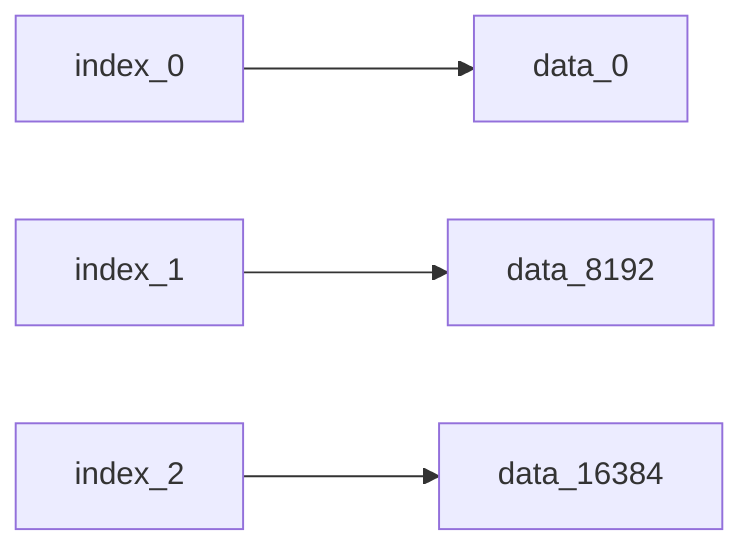

# ClickHouse MergeTree原理

[TOC]

## ClickHouse介绍

> ClickHouse is a column-oriented database management system (DBMS) for online analytical processing of queries (OLAP)

两个关键点：列式存储和OLAP


### **OLTP与OLAP**

对数据库中数据的操作场景


OLTP: *On-line Transaction Processing*

> Simple queries 
>
> that read/update a small amount of data 
>
> that is related to **a single entity** in the database.


SQL举例：

```sql
# 向DBMS发起的请求大多是对某个元组的数据的查询 修改 删除 增加
# 绝大部分业务系统发展初期对自身数据的操作都属于OLTP类型
select * from t_user where id = 1;
update t_user set name = "username" where id = 1;
delete from t_user where id = 1;
insert into t_user values(1, 'user1');
```


OLAP: *On-line Analytical Processing*

> Complex queries that read large portions of the database spanning multiple entities


SQL举例：

```sql
# 向DBMS发起的请求大多是查询某一张大表中的一部分字段的聚合信息(比如根据原始数据 生成分析后的报表信息) 修改和删除的情况很少或者没有
select class_id, avg(grade) 
from t_student 
where class_id < 10 
group by class_id;
```


### **行式存储与列式存储**

元组（行）的存储方式


行式存储 （N-ARY STORAGE MODEL NSM）

把一个元组的所有字段都连续存储在一个页中，适合对于OLTP的场景，因为对数据的操作通常是针对某个元组进行的，但不适合OLAP的场景，因为会从磁盘中加载大量的非必要字段到内存中


列式存储 （DECOMPOSITION STORAGE MODEL DSM）

将元组的不同字段存储在不同的页中，适合于OLAP的场景，因为查询一张大表的部分字段时，只会从磁盘中加载必要的字段到内存中，而且列式存储更有利于对数据进行压缩，进一步减少了数据存储空间与磁盘IO（重复的数据压缩比更高）


## MergeTree原理

ClickHouse有很多种表引擎，其中Merge Tree系列表引擎是最重要的，而接下来要将的MergeTree是Merge Tree  Family中最基础的

> Base [MergeTree](https://clickhouse.tech/docs/en/engines/table-engines/mergetree-family/mergetree/) table engine can be considered the default table engine for **single-node** ClickHouse instances


****

### 建表参数

```sql
CREATE TABLE [IF NOT EXISTS] [db.]table_name 
(
    name1 [type1] ,
    name2 [type2],
    ...
) ENGINE = MergeTree()
ORDER BY expr # ORDER BY为必填 以下皆为选填
[PARTITION BY expr]
[PRIMARY KEY expr]
[SETTINGS index_granularity=8192, ...]
```


#### **建表参数说明**

- `ORDER BY`： 排序键，指定一个数据片段内，数据排序的标准
- `PARTITION BY`： 分区键，指定表数据分区的标准，不指定则只有一个all分区
- `PRIMARY KEY`： 主键，默认情况下与`ORDER BY`相同，且允许存在重复的key
- `SETTINGS`: 可以配置很多key-value，最为关键的是`index_granularity` **==索引粒度==**这个属性 与后面的数据的索引 标记 存储都有关系

```sql
# 示例 建立一个用户的操作日志表
create table test.t_operate_log 
(username String, # 变长字符串
 time DateTime,   # 秒级的时间戳
 action String)  # 变长字符串 
 Engine = MergeTree() # 使用的表引擎
 PARTITION BY toYYYYMMDD(time) # 分区ID
 ORDER BY time # 排序键
 SETTINGS index_granularity=8192; # 索引粒度 默认也是8192
```


```shell
# 命令行进入数据库 这里没有设置密码数据库密码
clickhouse-client
```


```shell
# 创建表
create table test.t_operate_log (username String, time DateTime, action String) Engine = MergeTree() PARTITION BY toYYYYMMDD(time) ORDER BY time;
```


```shell
# 显示刚创建表的建表语句 发现索引粒度默认被设置为8192
show create table test.t_operate_log;
```


****

### **存储结构**

- table_name：表名
  - partition_1：分区目录 每个分区的数据**最终**都会放到一个分区目录下
    - checksums.txt：存储了目录下其余文件的size大小和size的哈希值，用于校验文件完整性
    - columns.txt：列信息文件，明文保存，保存该分区目录下所有列的字段信息
    - count.txt：计数文件，该分区目录下数据的总行数
    - minmax_[Column].idx：分区索引，存储了当前分区目录下分区字段的最小值和最大值
    - **primary.idx**：一级索引
    - **[Column].mrk**：与某个列对应的标记文件
    - **[Column].bin**：与某个列对应的数据文件，默认采用LZ4的方式压缩存储
  - partition_2
  - ...
  - partition_n


**示例**

1. 查看当前数据库

2. 进入test数据库

3. 查看数据库下的表

   

4. 进入默认的存储目录

5. 三个文件夹就对应三个数据库

6. 进入test数据库对应的文件目录 发现刚好有刚才创建的t_operarte_log对应的目录

   

7. 进入表对应的目录 查看分区 发现没有上面说的分区目录（是不是有问题？）

   

8. 没有分区的原因是因为分区是随着数据的插入动态生成的 试着往表中插入4条数据

   ```sql
   insert into test.t_operate_log values
   ('user_a', '2021-10-16 18:40:00', '登录系统'), 
   ('user_b', '2021-10-16 18:40:05', '登录系统'), 
   ('user_c', '2021-10-16 18:40:10', '登录系统'), 
   ('user_a', '2021-10-16 18:40:50', '登出系统');
   ```

   

9. 插入后 会生成分区

   
   
10. 进入分区 发现存储数据的文件 只有一个`data.bin` 而不是预期的三个列`useranme` `time` `action`对应的三个 `username.bin` `time.bin` `action.bin`  （这是怎么回事 说好的列式存储呢？）

    

11. 查阅MergeTree文档发现下面这一段话

    > Data parts can be stored in `Wide` or `Compact` format. In `Wide` format each column is stored in a separate file in a filesystem, in `Compact` format all columns are stored in one file. `Compact` format can be used to increase performance of small and frequent inserts.
    >
    > Data storing format is controlled by the `min_bytes_for_wide_part` and `min_rows_for_wide_part` settings of the table engine. If the number of bytes or rows in a data part is less then the corresponding setting's value, the part is stored in `Compact` format. Otherwise it is stored in `Wide` format. **If none of these settings is set, data parts are stored in `Wide` format.**

    最后这句话 个人感觉文档是有问题的 因为我这里没有设置上面两个MergeTree的参数 插入的数据量比较小的情况下 默认的数据存储格式是`Compact`格式（一个分区中所有列的数据存储在一个二进制文件中）

    在实际项目中存储没有设置这两个参数 插入的数据量和行数比较大(文件MB级 5000行的导入文件)  默认的是`Wide`格式

    所以推断是系统里面这两个参数是有非负的默认值的 只是文档里没有给出

    于是试着再创建一个相同的 手动指定这两个参数的表 并插入相同的数据

    ```sql
    create table test.t_operate_log_wide_part 
    (username String, 
     time DateTime, 
     action String) 
     Engine = MergeTree() 
     PARTITION BY toYYYYMMDD(time) 
     ORDER BY time  
     SETTINGS index_granularity=8192,
     # 指定了下面这两个参数
     min_rows_for_wide_part = 0,
     min_bytes_for_wide_part = 0;
     
     insert into test.t_operate_log_wide_part values
    ('user_a', '2021-10-16 18:40:00', '登录系统'), 
    ('user_b', '2021-10-16 18:40:05', '登录系统'), 
    ('user_c', '2021-10-16 18:40:10', '登录系统'), 
    ('user_a', '2021-10-16 18:40:50', '登出系统');
    ```

    

12. 进入新创建的`t_operate_log_wide_part`表的分区目录下查看 终于看到了预期的三个列对应的数据文件

    

13. 查看其他文本保存的信息

14. - 默认的压缩算法： LZ4
    - 列信息
    - 当前分区的数据量

    


****

### 分区

数据分区，可以通过分区索引帮助我们在查询时跳过不需要的数据文件，只需要处理最小的分区目录子集

(不推荐进行粒度过细的分区)

> 减少数据的扫描和处理范围 是分区-索引-存储设计的核心思想（剪枝）


#### **分区ID**

| 列值                  | 分区表达式                      | 分区ID   |
| --------------------- | ------------------------------- | -------- |
| '2021-10-16 19:27:41' | `PARTITION BY toYYYYMMDD(time)` | 20211016 |


#### **分区目录的命名规则**

分区ID\_最小数据块编号\_最大数据块编号_该分区被合并的次数


- 分区ID

- 最小数据块编号 最大数据块编号：

  每张MergeTree表独立 从1开始自增 再次往表中插入数据 分区ID相同 即同一天的数据 查看表目录发现生成了一个新的分区目录

  ```sql
  insert into test.t_operate_log_wide_part values 
  ('user_a', '2021-10-16 18:50:00', '登录系统'), 
  ('user_b', '2021-10-16 18:50:05', '登录系统'), 
  ('user_c', '2021-10-16 18:50:10', '登录系统'), 
  ('user_a', '2021-10-16 18:50:50', '登出系统');
  ```

  

- 该分区被合并的次数：初始值为0，也可以理解为分区的年龄，每合并一次 值+1


#### **分区目录的合并过程**


MergeTree分区目录特点：

- 分区目录在数据写入时动态创建 而非在表创建时创建（如前面演示的）

- 每一个`insert`语句 都会生成一批新的分区目录

- 同一个分区（即分区ID相同）也会存在多个对应的分区目录 在写入后的10-15分钟（或者手动执行`optimize`语句）后，ClickHouse会将同一个分区的多个目录合并为一个新的目录(进行Merge操作 即MergeTree中的Merge的由来) 

  旧分区目录会被标记删除（不立即删除） 在之后被物理删除


同一个分区的数据分批创建的优点：

> The data is quickly written to the table part by part, 
>
> then rules are applied for merging the parts in the background. 
>
> This method is much more efficient than continually rewriting the data in storage during insert
>
> （可以想想在B+树中插入数据的情况）


合并规则：同一个分区对应的多个分区目录 合并为一个分区目录

- 最小数据块编号：取所有分区目录的min值
- 最大数据块编号：取所有分区目录的max值
- 该分区被合并的次数 + 1


示例：

1. 手动执行`optimize`语句 强制合并该表的分区目录

   

2. 发现新生成的了一个合并后的目录 之前的目录也没有立即删除

   

3. 查看新分区目录的数据量 为8 为之前的两个分区目录的数据量之和 与预期一致 

   


****

### 索引

> 这里主要介绍一级索引

`PRIMARY KEY`定义后 MergeTree会根据`index_granularity ` 的间隔（默认8192），为数据生成一级索引并保存至`primary.idx`中


#### **稀疏索引**

一级索引为稀疏索引，且可以**常驻内存**，每一个索引标记对应的是一段数据

如`index_0`对应`[0,8191]`这段数据 `index_1`对应`[8192,16383]`这段数据 （书本中的章节目录就是一种稀疏索引）



#### **索引粒度** 

`index_granularity`

数据会以索引粒度的大小，被分为多个区间，每个区间的数据量 <= 索引粒度

索引粒度会影响到：

- 一级索引 `.idx`文件的生成
- 标记文件 `.mrk`文件的生成
- 数据存储文件 `.bin`文件的生成


#### **索引的生成规则**

```java
/**
	Java代码模拟一级索引生成
**/
@Data
@AllArgsConstructor
public class MergeTreePartition {

    /**
     * 索引粒度
     */
    private static final int INDEX_GRANULARITY = 8192;

    /**
     * 模拟username.bin
     * 存储用户名
     */
    private String[] usernames;

    /**
     * 模拟time.bin
     * 存储秒级时间戳
     */
    private long[] times;

    /**
     * 模拟action.bin
     * 存储操作日志内容
     */
    private String[] actions;

    /**
     * 模拟primary.idx
     * 存储一级索引
     * size为 分区内的 数据量 / 索引粒度  (结果向上取整)
     */
    private long[] indexs;

    public static void main(String[] args) {
        int dataNum = INDEX_GRANULARITY * 2 + 100;
        // 存储dataNum条数据 且数据以time为键递增 且分区ID为 toYYYYMMDD(now()) 当天时间
        OperateLog[] inputData = new OperateLog[dataNum];
        long time = System.currentTimeMillis() / 1000L;
        for (int i = 0; i < dataNum; i++) {
            // 模拟数据输入
            inputData[i] = new OperateLog("user" + i, time + ThreadLocalRandom.current().nextInt(3600), "登录系统");
        }
        // 按照主键time 进行排序
        Arrays.sort(inputData, (log1, log2) -> (int) (log1.time - log2.time));

        // 生成三个列对应的 .bin文件
        String[] usernames = new String[dataNum];
        long[] times = new long[dataNum];
        String[] actions = new String[dataNum];
        for (int i = 0; i < dataNum; i++) {
            usernames[i] = inputData[i].username;
            times[i] = inputData[i].time;
            actions[i] = inputData[i].action;
        }

        // 生成一级索引文件 每隔一个索引粒度 生成一个一级索引
        long[] indexs = new long[(int) Math.ceil(dataNum * 1.0 / INDEX_GRANULARITY)];
        for (int i = 0, j = 0; i < indexs.length && j < dataNum; i++, j += INDEX_GRANULARITY) {
            indexs[i] = inputData[j].time;
        }

        MergeTreePartition partition = new MergeTreePartition(usernames, times, actions, indexs);
    }

    @AllArgsConstructor
    private static class OperateLog {

        private String username;

        private long time;

        private String action;

    }
}
```


#### **索引的查询过程**

> 通过查询条件的**数值区间** -> 所查询的数据的**标记区间**的范围


`MarkRange`：

- 标记区间，一个索引粒度的数据段就是一个标记区间，用于后续进行数据读取时，最小化扫描的数据范围

- 有两个属性`start`, `end` 表述区间范围，

  如第一个标记区间为[0,1] 第二个标记区间[1,2] 第三个[2,3] ...

- 每个标记区间都有自己对应的**数值区间**

  索引粒度为8192的话 第一个标记区间对应的数据区间为[0,8192] 第二个为[8192, 16383]...

- 标记区间可以合并 也可以拆开表示


索引查询：就是基于两个**数值区间**的**交集**判断

- 基于主键的查询条件转化来的**数值区间**
- 标记区间对应的**数值区间**


示例：

假设 现在的表主键为 `ID String`，索引粒度为3

原始数据为

A000 A001 A002 A003.... A192 （193行数据）

第1个标记区间的[start,end] = [0,1]，对应的数值区间为[A000, A003]

第2个标记区间的[start,end] = [1,2]，对应的数值区间为[A003, A006]

...


过程：

1. 根据SQL的查询条件转化为数值区间 

   如： `where ID = 'A003'` -> `['A003', 'A003']`

2. 递归交集判断：数值区间从[A000, +inf]开始 判断数值区间与条件转化来的数值区间做交集

   - 如果不存在交集，剪枝 不继续判断
   - 如果存在交集
     - 标记区间的长度(end - start)大于8 将此区间继续拆分成8个子区间 进行递归计算
     - 标记区间长度 < 8，记录标记区间并返回

3. 合并标记区间


****

### 存储

#### **存储方式**

各列独自存储: 前面也看到了`columnName.bin`文件下存储了当前分区目录下该列的数据


**存储步骤**：

1. 对数据根据`ORDER BY`中的表达式的值进行排序 
2. 对数据进行压缩
3. 将数据以**压缩数据块**的形式分割 并写入`.bin`文件中


#### **压缩数据块**

内容 = 头信息 + 压缩数据

头信息：对该数据块进行解压时需要用的信息

- 压缩算法
- 压缩后的数据大小
- 压缩前的数据大小


```shell
# 查看某个数据文件中所有压缩数据块的头信息 
# 压缩后字节大小 压缩前字节大小
clickhouse-compressor --stat < /var/lib/clickhouse/data/test/t_operate_log_wide_part/20211016_1_2_1/time.bin
```


可以看到`time.bin`这个数据文件只有一个压缩数据块，压缩后大小为32字节，压缩前大小为43字节


压缩数据块的压缩前的字节范围：[64KB，1MB] [`min_compress_block_size`, `max_compress_block_size`]


**压缩数据块的生成**：

1. 根据**索引粒度** 获取一批数据（默认8192行的某一列的数据）
2. 对**未压缩前**数据的size进行判断
   1.  单批size < 64KB，继续获取下个批次，累积直至size >= 64KB后，才生成一个压缩数据块
   2.  64KB <= 单批size < 1MB 直接生成一个压缩数据块
   3.  单批size > 1MB 分割成多个压缩数据块 每个数据块最大为1MB


**.bin文件中引入压缩数据块的原因**：

对数据进行解压时，需要将磁盘中的压缩数据`.bin`文件加载到内存中进行解压，

解压会耗费时间，所以需要控制解压数据的大小，

引入压缩数据块后，解压时的读取粒度就降低到压缩数据块这个单位而不是整个`.bin`文件


****

### 标记

通过索引查询最终获取的**标记区间**获取数据在`.bin`文件中的偏移，部分常驻内存（LRU缓存策略）


类比：

| MergeTree概念    | 书籍概念                                   |
| ---------------- | ------------------------------------------ |
| MergeTree        | 书                                         |
| 一级索引 `.idx`  | 章节目录                                   |
| 数据文件  `.bin` | 书中的文字                                 |
| 压缩数据块       | 书中的段落                                 |
| 数据标记 `.mrk`  | 记录了章节目录的页码和文字在某一页中的位置 |


#### 数据标记的生成规则

与标记区间一一对应


`.mrk`文件中的内容


#### 数据标记的工作方式

1. 比如想找第一个标记区间对应的数据 即MarkRange[0,1]对应的数据 
2. 通过数据标记已知这个标记区间：
   - 标记区间所在的压缩数据块在`.bin`中的偏移
   - 压缩数据块解压后的数据中的偏移量为0
3. 先确定压缩数据块的字节范围 [0,12015]
4. 将该压缩数据块从磁盘读入内存中（引入压缩数据块的原因：降低解压时的读取粒度）
5. 对压缩数据块进行解压后，根据第二个偏移量就能找到第一个标记区间对应的字节范围[0,8191]


****

### 写入和查询


#### 写入

1. 生成分区目录，后续相同分区的分区目录会进行合并
2. 根据索引粒度，生成：
   - `.bin`压缩数据文件
   - `.mrk`数据标记
   - `primary.idx`一级索引


#### 查询

> 数据查询的本质：不断缩小数据范围的过程


匹配到索引时：

1. 根据分区索引、一级索引获取到标记区间的范围
2. 再根据数据标记 读取`.bin`文件 获取标记区间范围对应数据


**参考资料**

[ClickHouse原理解析与应用实践-第6章](https://book.douban.com/subject/35091211/) 

[MergeTree文档](https://clickhouse.com/docs/en/engines/table-engines/mergetree-family/mergetree/)