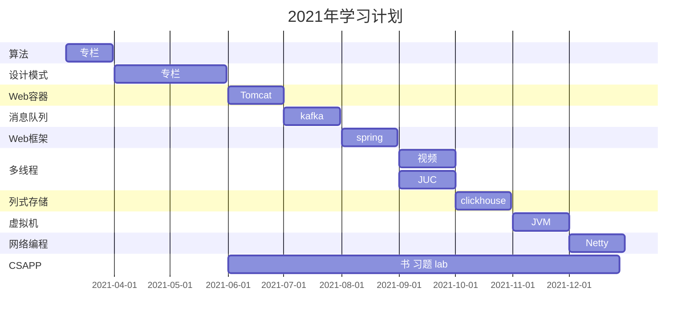
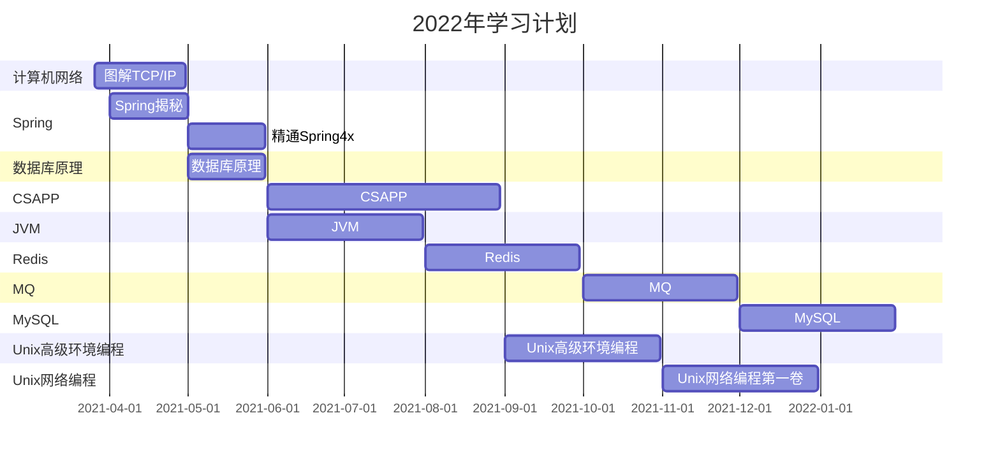

```mermaid
gantt
title 2021年学习计划
dateFormat YYYY-MM-DD
section 算法
专栏: 2021-03-06, 25d
section 设计模式
专栏: 2021-04-01, 60d
section Web容器
Tomcat: 2021-06-01, 30d
section 消息队列
kafka: 2021-07-01, 30d
section Web框架
spring: 2021-08-01, 30d
section 多线程
视频: 2021-09-01, 30d
JUC: 2021-09-01, 30d
section 列式存储
clickhouse: 2021-10-01, 30d
section 虚拟机
JVM: 2021-11-01, 30d
section 网络编程
Netty: 2021-12-01, 30d
section CSAPP
书 习题 lab: 2021-06-01, 210d
```

```mermaid
gantt
title 2022年学习计划
dateFormat YYYY-MM-DD
section 计算机网络
图解TCP/IP: 2021-03-26, 35d
section Spring
Spring揭秘: 2021-04-01, 30d
精通Spring4x: 2021-05-01, 30d
section 数据库原理
数据库原理: 2021-05-01, 30d
section CSAPP
CSAPP: 2021-06-01, 90d
section JVM
JVM: 2021-06-01, 60d
section Redis
Redis: 2021-08-01, 60d
section MQ
MQ: 2021-10-01, 60d
section MySQL
MySQL: 2021-12-01, 60d
section Unix高级环境编程
Unix高级环境编程: 2021-09-01, 60d
section Unix网络编程
Unix网络编程第一卷: 2021-11-01, 60d
```

