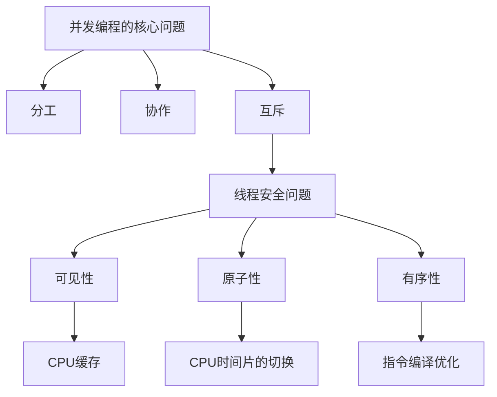

# Distruptor源码解析

[TOC]

## 并发基本问题




并发编程需要处理的3个问题：

- **分工**：当一个任务到来时 分配给哪个线程

  例子：

  当你要设计一个HTTP Server的时候 

  一个HTTP Request过来 应该分配哪个线程去处理这个Request

  - Worker Thread：

    java.util.concurrent.ThreadPoolExecutor （Tomcat方案）

  - Thread Per Message：

    来一个任务就开一个线程（协程）进行处理

- **协作**：线程之间的相互依赖 等待（线程间的通信）

  例子：

  - CountDownLatch：当一个线程要等待其他线程都完成时 才能继续往下执行
  - Lock：当一个线程要等待另外一个线程 完成对临界区的访问后 才能进去临界区时

- **互斥**：多个线程**并发修改**共享变量时 需要保证线程安全 即同一时刻 只允许一个线程访问共享变量 保证程序运行的正确性

  两种解决思路：

  - 互斥锁 保护共享变量的修改过程 
  - 无锁：
    - CAS + volatile：AtomicInteger
    - 避免并发：线程本地存储 (ThreadLocal)
    - 避免修改：类的对象设计为不可变的 （String）


## 如何设计一个循环队列

**版本一**

```java
/**
 * 循环队列
 */
public class CircularQueue {
    /**
     * 队列元素
     */
    private final int[] data;
    /**
     * 队头 指向待删除的元素位置
     */
    private int head;
    /**
     * 队尾 指向待插入的元素位置
     */
    private int tail;

    private final int capacity;

    public CircularQueue(int capacity) {
        this.capacity = capacity;
        data = new int[capacity];
    }

    public boolean offer(int val) {
        // 队满 (tail + 1) % capacity == head
        if ((tail + 1) % capacity == head) {
            return false;
        }
        data[tail] = val;
        tail = (tail + 1) % capacity;
        return true;
    }

    public int poll() {
        // 队空 head == tail
        if (head == tail) {
            return -1;
        }
        int res = data[head];
        head = (head + 1) % capacity;
        return res;
    }
}
```

版本一有什么问题？


**版本二**

```java
/**
 * 线程安全的循环队列
 * 通过互斥锁实现
 */
public class CircularQueueThreadSafe {
		
    private final Lock lock = new ReentrantLock();

    private final Condition notEmpty = lock.newCondition();

    private final Condition notFull = lock.newCondition();

    /**
     * 队列元素
     */
    private final int[] data;
    /**
     * 队头 指向待删除的元素位置
     */
    private int head;
    /**
     * 队尾 指向待插入的元素位置
     */
    private int tail;

    private final int capacity;

    public CircularQueueThreadSafe(int capacity) {
        this.capacity = capacity;
        data = new int[capacity];
    }

    public boolean offer(int val) throws InterruptedException {
        lock.lockInterruptibly();
        try {
            // 队满 (tail + 1) % capacity == head
            if ((tail + 1) % capacity == head) {
                notFull.await();
            }
            data[tail] = val;
            tail = (tail + 1) % capacity;
            notEmpty.signal();
        } finally {
            lock.unlock();
        }
        return true;
    }

    public int poll() throws InterruptedException {
        lock.lockInterruptibly();
        try {
            // 队空 head == tail
            if (head == tail) {
                notEmpty.await();
            }
            int res = data[head];
            head = (head + 1) % capacity;
            notFull.signal();
            return res;
        } finally {
            lock.unlock();
        }
    }
}
```

版本二存在什么问题？


## Distruptor

> Distruptor本质上也是一个线程安全的循环队列 

应用了Distruptor的框架和组件：

Log4j2、Spring Messaging、HBase、Storm


性能：

- 吞吐量

  |                    | Array Blocking Queue | Disruptor  |
  | ------------------ | -------------------- | ---------- |
  | Unicast: 1P – 1C   | 4,057,453            | 22,381,378 |
  | Pipeline: 1P – 3C  | 2,006,903            | 15,857,913 |
  | Sequencer: 3P – 1C | 2,056,118            | 14,540,519 |
  | Multicast: 1P – 3C | 260,733              | 10,860,121 |
  | Diamond: 1P – 3C   | 2,082,725            | 15,295,197 |

- 延迟

  |                               | Array Blocking Queue (ns) | Disruptor (ns) |
  | ----------------------------- | ------------------------- | -------------- |
  | Mean Latency                  | 32,757                    | 52             |
  | 99% observations less than    | 2,097,152                 | 128            |
  | 99.99% observations less than | 4,194,304                 | 8,19           |


高性能原因：

- 队列元素预分配
- 避免缓存伪共享
- CAS入队 
- 支持批量消费和批量生产


**循环队列元素预分配**

```java
// entries就是内部使用的数组
for (int i = 0; i < bufferSize; i++) {
  // 数组中的元素为一个包装类对象 对象中存的是实际处理元素 
	entries[BUFFER_PAD + i] = eventFactory.newInstance();
}
```

好处：

- 更高效利用CPU缓存 

  同一个时间点创建的对象引用地址 在内存中大概率是连续的

  程序的局部性 + CPU一次从内存中加载一个缓存行大小的数据到CPU缓存中

  所以访问entries[i]对象后 entries[i + 1]对象也被加载到了CPU缓存中 

  就不用再到内存中获取了

- 避免频繁的GC

  因为`publishEvent()`的时候 并不是创建一个新的Event 而是event.set()修改Event中内容 所以数组中的元素不会被GC掉


**避免缓存伪共享**


## Log4j2中对Distruptor中的应用